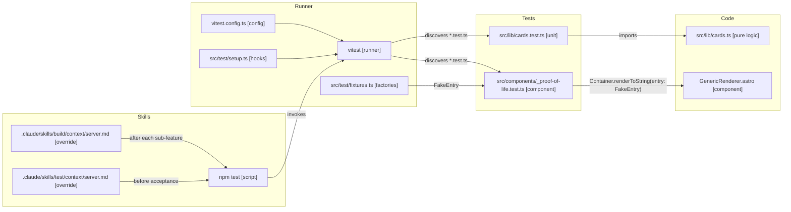

# Feature: Add Testing Support

**Status:** EXPERIMENTING
**Created:** 2026-04-11
**Updated:** 2026-04-11

## Context

The project currently has no test framework. This blocks TDD for new features (e.g. `horizontal-card-stack`'s `updateStackLayout()` is a natural pure-logic target) and prevents regression testing as part of the feature-development pipeline. Adding a minimal, opinionated testing setup here unblocks both: future plans can extract pure logic and test it, and `/build` / `/test` can run the suite as a regression gate. Backfilling tests for existing functionality is deliberately out of scope — it'll be a separate plan once this infrastructure exists.

## Architecture Decisions

1. **Vitest as the test runner** — first-class Vite/Astro integration, reuses `astro.config.mjs` transforms, near-zero config for TypeScript, and is the framework Astro's own docs recommend. Jest would require separate transform config for no gain.

2. **happy-dom as the DOM environment** — significantly faster than jsdom, and its gaps (CSS computed styles, some edge-case APIs) don't matter for the tests we'll realistically write. Anything that needs real layout or View Transitions (`document.startViewTransition`) is out of reach for *any* DOM shim and would push us to Playwright regardless — that's a ceiling, not a happy-dom-specific limitation. Switching to jsdom later is a one-line change in `vitest.config.ts`.

3. **Astro Container API (`experimental_AstroContainer`) for component tests** — the official path for rendering `.astro` components in isolation. Returns HTML that we parse with happy-dom and assert against. Avoids hand-rolling component rendering.

4. **Tests co-located with source as `*.test.ts`** — matches Vitest defaults, keeps logic and test within one glance, and means moving a file doesn't orphan its test. No separate `tests/` tree.

5. **Shared test utilities live in `src/test/`** — fixture factories for fake content entries, Container setup helpers, happy-dom bootstrapping. Not co-located because they're cross-cutting.

6. **Two proof-of-life tests, no more** — one unit test against `src/lib/cards.ts` (renderer dispatch, already pure) and one component test that renders `GenericRenderer` via Container. These prove both code paths work end-to-end. Broader coverage is explicitly a separate plan.

7. **This plan does not extract any logic from `StackNav.astro`** — pure-logic extraction is a prerequisite for testing StackNav, but it belongs to whichever feature plan needs it (e.g. `horizontal-card-stack`'s `updateStackLayout()`). This plan only sets up the infrastructure.

8. **`/build` and `/test` skill integration via project-local context files** — create `.claude/skills/build/context/server.md` and `.claude/skills/test/context/server.md` in this project, overriding the global Godot-specific ones. They tell the skills to run `npm test` after each sub-feature (`/build`) and on the integration branch before acceptance (`/test`). This is how regression testing enters the feature-development pipeline.

9. **No CI gate, no Playwright, no backfill** — local-only, unit + component DOM tests only, and existing functionality gets its own follow-up plan.

## System Diagram

## Structure

### New Files

- [ ] `vitest.config.ts`
  - Environment: `happy-dom`
  - Globals on (`describe`, `it`, `expect` without imports)
  - Setup file: `src/test/setup.ts`
  - Path aliases inherited from `tsconfig.json`
  - Include pattern: `src/**/*.test.ts`

- [ ] `src/test/setup.ts`
  - Empty initial hook file; exists to anchor future global test setup (e.g. resetting happy-dom state between tests if needed)

- [ ] `src/test/fixtures.ts`
  - `fakeEntry(collection, overrides)` — returns a minimal content-collection entry shape that satisfies the renderer prop contract
  - `fakeContent()` — returns a stub `Content` Astro component (or `undefined` to exercise the no-content path)
  - One factory per collection as needed; start with a generic one

- [ ] `src/lib/cards.test.ts`
  - Test 1: every key in `COLLECTION_DEFAULTS` resolves to a registered renderer in `COLLECTION_RENDERERS`
  - Test 2: the renderer-dispatch fallback chain (explicit renderer → collection default → `GenericRenderer`) returns the expected component for a representative collection
  - Pure logic only — no DOM, no Container

- [ ] `src/components/_proof-of-life.test.ts`
  - Renders `GenericRenderer` via `experimental_AstroContainer.create()` with a fake entry
  - Parses the returned HTML with happy-dom
  - Asserts: the entry title appears in the output, and the expected wrapper class exists
  - Confirms the component-testing path works end-to-end

- [ ] `.claude/skills/build/context/server.md`
  - Project-local override of the global Godot server context
  - `/build` runs `npm test` after each sub-feature; failure blocks progression (treated as a code issue, same pattern as the global file uses for GUT)
  - No APK/artifact section — Astro preview is handled by the existing systemd service

- [ ] `.claude/skills/test/context/server.md`
  - Project-local override of the global Godot server context
  - `/test` runs `npm test` on the integration branch before acceptance
  - Acceptance prompt pattern: combines sub-feature `**Acceptance:**` fields into a checklist the user confirms in a browser (since UI behaviour isn't unit-testable)

### Modified Files

- [ ] `package.json`
  - Changes:
    - [ ] Add devDependencies: `vitest`, `happy-dom`, `@astrojs/check` (if not present, for type-checking in tests)
    - [ ] Add script: `"test": "vitest run"`
    - [ ] Add script: `"test:watch": "vitest"`

- [ ] `CLAUDE.md`
  - Changes:
    - [ ] Add a `## Testing` section documenting: where tests live (`src/**/*.test.ts`), how to run them (`npm test` / `npm run test:watch`), the DOM environment (happy-dom), the component-test pattern (Container API), and the "pure logic must be extractable" invariant's concrete testing contract

## Dependencies

- **`src/lib/cards.ts`** — existing pure logic; first unit test target. No changes expected.
- **`src/components/GenericRenderer.astro`** — existing component; first component test target. No changes expected.
- **`astro:content`** — the content collection module; flagged as an unknown (see below). May require mocking or build-step dependency in the Vitest environment.
- **`/build` and `/test` skills** — integration via project-local context files. Assumes project-local skill context resolution works; if it turns out not to, we'll need a different integration point, but the plan doesn't change shape.
- **`horizontal-card-stack` plan (downstream)** — will be the first real consumer of this infrastructure, extracting `updateStackLayout()` as pure logic and testing it. This plan must land first.

## Unknowns & Experiments

### Container API + content collections

- **Unknown**: Does `experimental_AstroContainer.renderToString()` work for components that import from `astro:content`, when run under Vitest outside of an Astro build? Renderers like `GenericRenderer` don't themselves call `getCollection()`, but if any transitively-imported module does, Vitest may fail to resolve the `astro:content` virtual module.
- **Risk**: If it fails, component tests for renderers with content-collection dependencies are blocked until we either (a) mock `astro:content` in `vitest.config.ts`, (b) run `astro build` as a pretest step to populate the content DB, or (c) restrict component tests to "leaf" components that don't touch content. Unit tests are unaffected.
- **Experiment**: Add a minimal Vitest + Container setup on a throwaway branch. Render `GenericRenderer` with a fake entry. Observe: does `astro:content` resolve? If not, what's the error? Try option (a) first — a lightweight mock via `vi.mock('astro:content', ...)`.
- **Result**: pending
- **Impact**: If (a) works, the plan stands. If we need (b) or (c), Architecture Decision 6 narrows (component test scope reduced to leaf renderers) and `package.json` scripts change to include a prebuild step.

### happy-dom coverage for real StackNav component tests

- **Unknown**: When we eventually (in a later plan) extract pure logic from `StackNav.astro` and write component tests that click handlers, does happy-dom provide enough DOM surface to exercise the non-VT paths? Specifically: `element.animate()`, `scrollIntoView()`, event delegation on `#card-stack`, and classList toggling. `document.startViewTransition` is known to be missing from both shims — those code paths must be guarded and tested via the instant-fallback branch only.
- **Risk**: If happy-dom has unexpected gaps for the non-VT paths, we'd need to either stub more of the DOM or switch to jsdom (one-line change). This wouldn't block this plan — it would land on whichever downstream plan first writes a StackNav component test.
- **Experiment**: On the same throwaway branch, write a minimal component test that simulates a click on a fake `.stack-card` element and asserts that a class toggle happens. Use the current inline StackNav script logic (pasted, not imported) just to probe what happy-dom supports. This is a *probe*, not a real test — it gets deleted after.
- **Result**: pending
- **Impact**: If happy-dom holds up, Decision 2 stands. If it falls over on something load-bearing, switch `environment` in `vitest.config.ts` to `jsdom` and add `jsdom` as a devDep.

## Notes

- 2026-04-11: Initial plan. Scope confirmed with user: Vitest + happy-dom + Container API, co-located tests, two proof-of-life tests, `/build` and `/test` skill integration via project-local context files. Out of scope: pure-logic extraction from StackNav, backfilling tests for existing code, Playwright, CI. Two unknowns queued: Container + `astro:content` interaction, and happy-dom coverage for eventual StackNav component tests. Skill-resolution behaviour (whether project-local `.claude/skills/*/context/server.md` actually overrides globals) is trusted on soft evidence — will become clear during `/build` if it's a problem. Status → EXPERIMENTING. Run `/experiment add-testing-support` to resolve the two unknowns before plan review.
