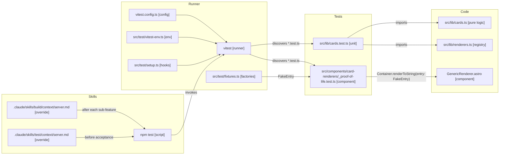

# Feature: Add Testing Support

## Context

The project currently has no test framework. This blocks TDD for new features (e.g. `horizontal-card-stack`'s `updateStackLayout()` is a natural pure-logic target) and prevents regression testing as part of the feature-development pipeline. Adding a minimal, opinionated testing setup here unblocks both: future plans can extract pure logic and test it, and `/build` / `/test` can run the suite as a regression gate. Backfilling tests for existing functionality is deliberately out of scope — it'll be a separate plan once this infrastructure exists.

## Architecture Decisions

1. **Vitest as the test runner** — first-class Vite/Astro integration, reuses `astro.config.mjs` transforms, near-zero config for TypeScript, and is the framework Astro's own docs recommend. Jest would require separate transform config for no gain.

2. **happy-dom as the DOM environment** — significantly faster than jsdom, and its gaps (CSS computed styles, some edge-case APIs) don't matter for the tests we'll realistically write. Anything that needs real layout or View Transitions (`document.startViewTransition`) is out of reach for *any* DOM shim and would push us to Playwright regardless — that's a ceiling, not a happy-dom-specific limitation. Switching to jsdom later is a one-line change in `vitest.config.ts`.

3. **Astro Container API (`experimental_AstroContainer`) for component tests** — the official path for rendering `.astro` components in isolation. Returns HTML that we parse with happy-dom and assert against. Avoids hand-rolling component rendering.

4. **Tests co-located with source as `*.test.ts`** — matches Vitest defaults, keeps logic and test within one glance, and means moving a file doesn't orphan its test. No separate `tests/` tree.

5. **Shared test utilities live in `src/test/`** — fixture factories for fake content entries, Container setup helpers, happy-dom bootstrapping. Not co-located because they're cross-cutting.

6. **Two proof-of-life tests, no more** — one unit test against `src/lib/cards.ts` (renderer dispatch, already pure) and one component test that renders `GenericRenderer` via Container. These prove both code paths work end-to-end. Broader coverage is explicitly a separate plan.

7. **This plan does not extract any logic from `StackNav.astro`** — pure-logic extraction is a prerequisite for testing StackNav, but it belongs to whichever feature plan needs it (e.g. `horizontal-card-stack`'s `updateStackLayout()`). This plan only sets up the infrastructure.

8. **`COLLECTION_RENDERERS` moves to `src/lib/renderers.ts`** — CLAUDE.md says the renderer registry belongs in lib, but it currently lives inline in `src/pages/card/[...path].astro`. A new `renderers.ts` file holds the component-to-collection mapping. `cards.ts` stays free of component imports (it's pure data/logic). The page imports from `renderers.ts`. This also makes the registry testable without reaching into a page file.

9. **`/build` and `/test` skill integration via project-local context files** — create `.claude/skills/build/context/server.md` and `.claude/skills/test/context/server.md` in this project, overriding the global Godot-specific ones. They tell the skills to run `npm test` after each sub-feature (`/build`) and on the integration branch before acceptance (`/test`). This is how regression testing enters the feature-development pipeline.

10. **No CI gate, no Playwright, no backfill** — local-only, unit + component DOM tests only, and existing functionality gets its own follow-up plan.

## System Diagram

## Structure

### New Files

- [x] `vitest.config.ts` *(created during experiments)*
  - Uses `getViteConfig` from `astro/config` as the config helper
  - Environment: `./src/test/vitest-env.ts` (custom — see below)
  - Globals on (`describe`, `it`, `expect` without imports)
  - Setup file: `src/test/setup.ts`
  - Include pattern: `src/**/*.test.ts`

- [x] `src/test/vitest-env.ts` *(created during experiments)*
  - Custom Vitest environment named `astro-happy-dom`
  - Sets `viteEnvironment: 'ssr'` — required so the Astro Vite plugin compiles `.astro` files as SSR component factories rather than returning browser stubs
  - Provides happy-dom DOM globals via `populateGlobal` (same setup as the built-in `happy-dom` environment)
  - **Must not be renamed to `happy-dom`** — that name is hardcoded in Vitest to use `viteEnvironment: 'client'`

- [ ] `src/test/setup.ts`
  - Empty initial hook file; exists to anchor future global test setup

- [ ] `src/test/fixtures.ts`
  - `fakeEntry(overrides?)` — returns a minimal object satisfying `{ data: { description?: string } }` for use as a `GenericRenderer` prop
  - `fakeContent()` — returns `undefined` (exercises the no-content path); extend later if a Content stub is needed

- [ ] `src/lib/renderers.ts`
  - `COLLECTION_RENDERERS: Record<string, AstroComponentFactory>` — maps collection names and renderer name strings to the actual component. Mirrors `COLLECTION_DEFAULTS` in `cards.ts` but holds the component references
  - Contains: `{ tag: TagRenderer, puzzles: PuzzleRenderer }` — collections not listed fall through to `GenericRenderer` at the call site
  - Imported by `src/pages/card/[...path].astro` (replacing its inline definition) and by `src/lib/cards.test.ts`

- [ ] `src/lib/cards.test.ts`
  - Test 1: every key in `COLLECTION_DEFAULTS` (from `cards.ts`) that has a non-generic renderer is present in `COLLECTION_RENDERERS` (from `renderers.ts`) — catches unregistered renderer names
  - Test 2: collections with explicit renderers (`tag` → `TagRenderer`, `puzzles` → `PuzzleRenderer`) resolve to the right component via `COLLECTION_RENDERERS`; a collection without a special renderer (`posts`) is absent from `COLLECTION_RENDERERS` (confirming it falls through to `GenericRenderer` at the call site)
  - Pure logic only — no DOM, no Container

- [ ] `src/components/card-renderers/_proof-of-life.test.ts`
  - Renders `GenericRenderer` via `experimental_AstroContainer` from `astro/container` with a fake entry
  - Parses the returned HTML string using `document.createElement('div')` + `innerHTML`
  - Asserts: the entry `description` text appears in the rendered output (not `title` — `GenericRenderer` renders `description`, not `title`)
  - Confirms the component-testing path works end-to-end

- [ ] `.claude/skills/build/context/server.md`
  - Project-local override of the global server context
  - After each sub-feature: run `npm test`; failure is treated as a code issue (blocks progression)
  - No build/install section — Astro preview is handled by the existing systemd service

- [ ] `.claude/skills/test/context/server.md`
  - Project-local override of the global server context
  - Before acceptance: run `npm test` on the integration branch
  - Acceptance prompt: combine sub-feature `**Acceptance:**` fields into a browser checklist (UI behaviour is not unit-testable)

### Modified Files

- [ ] `src/lib/cards.ts`
  - Changes:
    - [ ] No functional changes — `COLLECTION_DEFAULTS` and `resolveRenderer` stay as-is; `resolveRenderer` remains unexported (tests don't need it directly)

- [ ] `src/pages/card/[...path].astro`
  - Changes:
    - [ ] Remove inline `COLLECTION_RENDERERS` definition (lines 20–23)
    - [ ] Add `import { COLLECTION_RENDERERS } from '../../lib/renderers'`

- [ ] `package.json`
  - Changes:
    - [x] `vitest`, `@vitest/ui`, `happy-dom` added as devDependencies *(done during experiments)*
    - [ ] Add script: `"test": "vitest run"`
    - [ ] Add script: `"test:watch": "vitest"`

- [ ] `CLAUDE.md`
  - Changes:
    - [ ] Add `## Testing` section: where tests live (`src/**/*.test.ts`), how to run (`npm test` / `npm run test:watch`), why the custom environment is required (`viteEnvironment: 'ssr'`), `element.animate()` guard note, component-test pattern (`experimental_AstroContainer`), and the concrete testing contract for the "pure logic must be extractable" invariant
    - [ ] Update `COLLECTION_RENDERERS` reference in Conventions to say `src/lib/renderers.ts`

## Dependencies

- **`src/lib/cards.ts`** — provides `COLLECTION_DEFAULTS`; no functional changes.
- **`src/pages/card/[...path].astro`** — loses its inline `COLLECTION_RENDERERS`; imports from `src/lib/renderers.ts` instead.
- **`src/components/card-renderers/GenericRenderer.astro`** — first component test target. No changes.
- **`src/components/card-renderers/TagRenderer.astro`, `PuzzleRenderer.astro`** — imported by `renderers.ts`.
- **`astro:content`** — `type`-only import in `GenericRenderer`; erased at build time, no runtime resolution needed.
- **`/build` and `/test` skills** — integration via project-local context files. Skill-context resolution (project-local overrides global) is trusted on soft evidence; if it fails, this is the first plan to surface it.
- **`horizontal-card-stack` plan (downstream)** — first real consumer; will extract `updateStackLayout()` as pure logic and test it. This plan must land first.

## Unknowns & Experiments

### Container API + content collections

- **Unknown**: Does `experimental_AstroContainer.renderToString()` work for components that import from `astro:content`, when run under Vitest outside of an Astro build? Renderers like `GenericRenderer` don't themselves call `getCollection()`, but if any transitively-imported module does, Vitest may fail to resolve the `astro:content` virtual module.
- **Risk**: If it fails, component tests for renderers with content-collection dependencies are blocked until we either (a) mock `astro:content` in `vitest.config.ts`, (b) run `astro build` as a pretest step to populate the content DB, or (c) restrict component tests to "leaf" components that don't touch content. Unit tests are unaffected.
- **Experiment**: Add a minimal Vitest + Container setup on a throwaway branch. Render `GenericRenderer` with a fake entry. Observe: does `astro:content` resolve? If not, what's the error? Try option (a) first — a lightweight mock via `vi.mock('astro:content', ...)`.
- **Result**: CONFIRMED — Container API works end-to-end. `astro:content` type import (`import type { RenderResult }`) is erased at build time and causes no issues. The blocker was a different one: the built-in `happy-dom` Vitest environment sets `viteEnvironment: "client"`, causing the Astro Vite plugin to return a browser stub for `.astro` imports instead of the real SSR component factory. Fix: create a custom Vitest environment (`src/test/vitest-env.ts`) that provides happy-dom DOM globals but sets `viteEnvironment: "ssr"`. With that in place, `GenericRenderer` renders correctly and returns expected HTML.
- **Impact**: Architecture Decision 2 requires an addendum: a custom Vitest environment file (`src/test/vitest-env.ts`) is needed, named `astro-happy-dom`, that wraps happy-dom globals with `viteEnvironment: "ssr"`. The `vitest.config.ts` points to this file as the environment. `vitest`, `@vitest/ui`, and `happy-dom` are already installed. `getViteConfig` from `astro/config` is used as the config helper.

### happy-dom coverage for real StackNav component tests

- **Unknown**: When we eventually (in a later plan) extract pure logic from `StackNav.astro` and write component tests that click handlers, does happy-dom provide enough DOM surface to exercise the non-VT paths? Specifically: `element.animate()`, `scrollIntoView()`, event delegation on `#card-stack`, and classList toggling. `document.startViewTransition` is known to be missing from both shims — those code paths must be guarded and tested via the instant-fallback branch only.
- **Risk**: If happy-dom has unexpected gaps for the non-VT paths, we'd need to either stub more of the DOM or switch to jsdom (one-line change). This wouldn't block this plan — it would land on whichever downstream plan first writes a StackNav component test.
- **Experiment**: On the same throwaway branch, write a minimal component test that simulates a click on a fake `.stack-card` element and asserts that a class toggle happens. Use the current inline StackNav script logic (pasted, not imported) just to probe what happy-dom supports. This is a *probe*, not a real test — it gets deleted after.
- **Result**: CONFIRMED with a gap. classList toggling, click event delegation, `scrollIntoView()` (no-op, no throw), CSS custom properties via inline style, and querySelector/querySelectorAll all work. `element.animate()` is **not available** in this happy-dom version — future StackNav tests that exercise animation paths will need a `typeof el.animate === 'function'` guard. The non-animation paths (which is the testable surface anyway — VT paths are excluded by design) are fully covered.
- **Impact**: Decision 2 stands. One addendum: document that `element.animate()` is absent from happy-dom; StackNav tests must guard animation calls. This is consistent with the existing note about `document.startViewTransition` being unavailable.

## Notes

- 2026-04-11: Initial plan. Scope confirmed with user: Vitest + happy-dom + Container API, co-located tests, two proof-of-life tests, `/build` and `/test` skill integration via project-local context files. Out of scope: pure-logic extraction from StackNav, backfilling tests for existing code, Playwright, CI. Two unknowns queued: Container + `astro:content` interaction, and happy-dom coverage for eventual StackNav component tests. Skill-resolution behaviour (whether project-local `.claude/skills/*/context/server.md` actually overrides globals) is trusted on soft evidence — will become clear during `/build` if it's a problem. Status → EXPERIMENTING. Run `/experiment add-testing-support` to resolve the two unknowns before plan review.
- 2026-04-13: All experiments resolved. Architecture confirmed with addenda: (1) a custom Vitest environment (`src/test/vitest-env.ts`) is required — built-in `happy-dom` sets `viteEnvironment: "client"` which breaks `.astro` SSR imports; (2) `element.animate()` is absent from this happy-dom version — future StackNav tests must guard animation calls. `vitest`, `@vitest/ui`, and `happy-dom` installed. Status → ARCHITECTURE. Ready for `/plan-feature add-testing-support` to do final review and `/split`.
- 2026-04-13: Plan review complete. Three issues fixed: (1) `COLLECTION_RENDERERS` moved from page file to new `src/lib/renderers.ts` — makes it testable and fixes CLAUDE.md convention violation; (2) unit test targets redesigned to match what's actually exported (`COLLECTION_DEFAULTS` ↔ `COLLECTION_RENDERERS` cross-check); (3) proof-of-life assertion corrected from "title" to "description" (`GenericRenderer` renders `description`, not `title`). Structure updated to reflect experiment artefacts (`vitest.config.ts`, `src/test/vitest-env.ts`) already created. CLAUDE.md update scope expanded to cover `renderers.ts` and testing conventions.
- 2026-04-13: Splitting. Skill context approach revised: use global `~/.claude/skills/<skill>/context/astro-web.md` (platform-invariant type context) rather than project-local files. Build and test skills updated in SF4 to support `context/<type>.md` loading step. Status → SPLITTING.
- 2026-04-13: Split approved. 4 sub-features: SF1 (test infrastructure), SF2 (renderer registry), SF3 (proof-of-life tests), SF4 (skill integration & docs). SF1 and SF2 are independent; SF3 depends on both; SF4 depends on SF3. Status → IN PROGRESS.
- 2026-04-13: All sub-features accepted. Status → COMPLETE.
- 2026-04-13: Feature archived. Plan retained for reference.
- 2026-04-13: Review passed — architecture, principles, test coverage (post-split). Fixed: duplicate Architecture Decision 9 renumbered to 10; `**Files:**` → `**Structure items:**` with checkboxes; `**Test Cases:**` added to all SFs; `**Depends on:** —` → `none` for SF1/SF2.

## Sub-Features

### SF1: Test Infrastructure
**Depends on:** none

**Test Cases:** none — verified by `npm test` exit code only

**Structure items:**
- `src/test/setup.ts`
  - [x] Empty hook file; anchors future global setup
- `package.json`
  - [x] Add script: `"test": "vitest run"`
  - [x] Add script: `"test:watch": "vitest"`
- `vitest.config.ts`
  - [x] Added `include: ['src/**/*.test.ts']`, `setupFiles`, `passWithNoTests: true`

**Testing:** Run `npm test` — should exit cleanly with 0 tests found (or "No test files found").
**Acceptance test:** no

---

### SF2: Renderer Registry
**Depends on:** none

**Test Cases:** none — verified by acceptance (browser) only; automated coverage arrives in SF3

**Structure items:**
- `src/lib/renderers.ts`
  - [x] `COLLECTION_RENDERERS: Record<string, AstroComponentFactory>` — maps `tag` → `TagRenderer`, `puzzles` → `PuzzleRenderer`
- `src/pages/card/[...path].astro`
  - [x] Remove inline `COLLECTION_RENDERERS` definition (lines 20–23)
  - [x] Add `import { COLLECTION_RENDERERS } from '../../lib/renderers'`

**Testing:** Hit a tag card and a puzzle card in the browser and confirm they render correctly. Hit a posts card (generic renderer) and confirm it also renders. The refactor should be invisible to the user.
**Acceptance test:** yes

---

### SF3: Proof-of-Life Tests
**Depends on:** SF1, SF2

**Test Cases:**
- `src/lib/cards.test.ts`:
  - [x] `all non-generic COLLECTION_DEFAULTS keys present in COLLECTION_RENDERERS`: imports both registries; asserts every key in `COLLECTION_DEFAULTS` whose renderer name is not `'generic'` exists as a key in `COLLECTION_RENDERERS`
  - [x] `explicit renderers resolve correctly and generic collections are absent`: asserts `COLLECTION_RENDERERS['tag'] === TagRenderer`, `COLLECTION_RENDERERS['puzzles'] === PuzzleRenderer`, and `'posts' in COLLECTION_RENDERERS === false`
- `src/components/card-renderers/_proof-of-life.test.ts`:
  - [x] `GenericRenderer renders description text`: creates Container, calls `renderToString(GenericRenderer, { props: { entry: fakeEntry({ description: 'hello world' }) } })`, parses HTML, asserts `'hello world'` appears in output

**Structure items:**
- `src/test/fixtures.ts`
  - [x] `fakeEntry(overrides?)` — returns minimal `{ data: { description?: string } }`
  - [x] `fakeContent()` — returns `undefined`
- `src/lib/cards.ts`
  - [x] Export `COLLECTION_DEFAULTS` (needed by unit test)
- `src/lib/cards.test.ts`
  - [x] Test 1: cross-check `COLLECTION_DEFAULTS` → `COLLECTION_RENDERERS` (catches unregistered names)
  - [x] Test 2: explicit renderer identity + generic fallthrough confirmed
- `src/components/card-renderers/_proof-of-life.test.ts`
  - [x] Render `GenericRenderer` via Container with `fakeEntry`; assert `description` text in output

**Testing:** Run `npm test` — must pass with exactly 3 tests across 2 files.
**Acceptance test:** no

---

### SF4: Skill Integration & Documentation
**Depends on:** SF3

**Test Cases:** none — verified by acceptance (skill invocation) only

**Structure items:**
- `~/.claude/skills/build/SKILL.md`
  - [x] Add `context/<type>.md` loading step between platform and type+platform steps
- `~/.claude/skills/test/SKILL.md`
  - [x] Add `context/<type>.md` loading step between platform and type+platform steps
- `~/.claude/skills/implement-subfeature/SKILL.md`
  - [x] Same addition (had same pattern)
- `~/.claude/skills/build/context/astro-web.md`
  - [x] After each sub-feature: run `npm test`; failure is a code issue, blocks progression
- `~/.claude/skills/test/context/astro-web.md`
  - [x] Step 1: run `npm test`; acceptance: browser checklist from sub-feature `**Testing:**` fields
- `.claude/project.md`
  - [x] `name`, `type: astro-web`, `plans: dev/plans/`
- `CLAUDE.md`
  - [x] Add `## Testing` section (test location, run commands, custom environment rationale, `element.animate()` guard, Container API pattern, pure-logic contract)
  - [x] Update `COLLECTION_RENDERERS` reference in Conventions to `src/lib/renderers.ts`

**Testing:** Run `/build` on a plan in a separate project and confirm it picks up the `astro-web` context and runs `npm test` after each sub-feature. Confirm `.claude/project.md` type resolves correctly.
**Acceptance test:** yes
