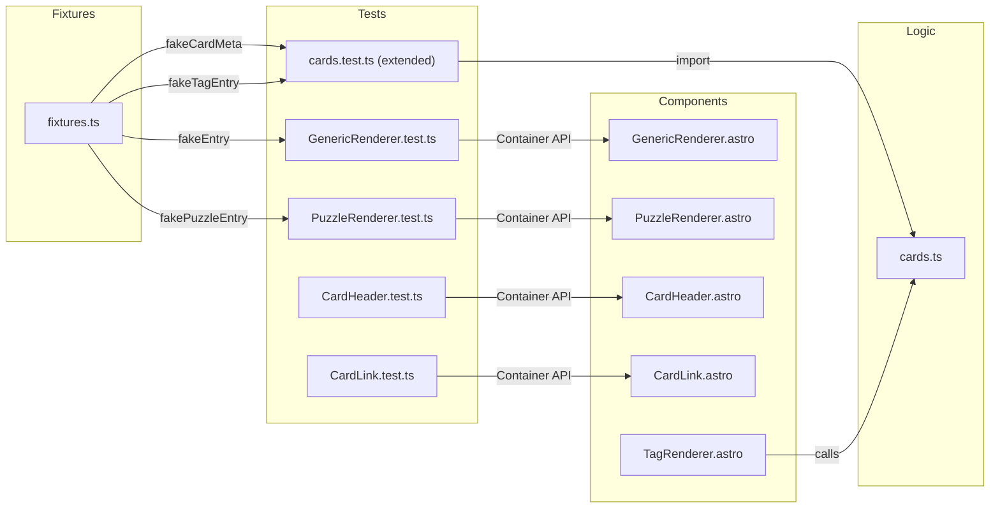
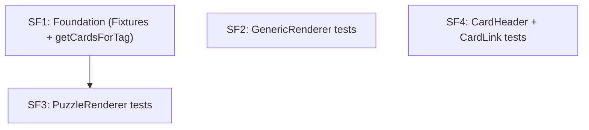
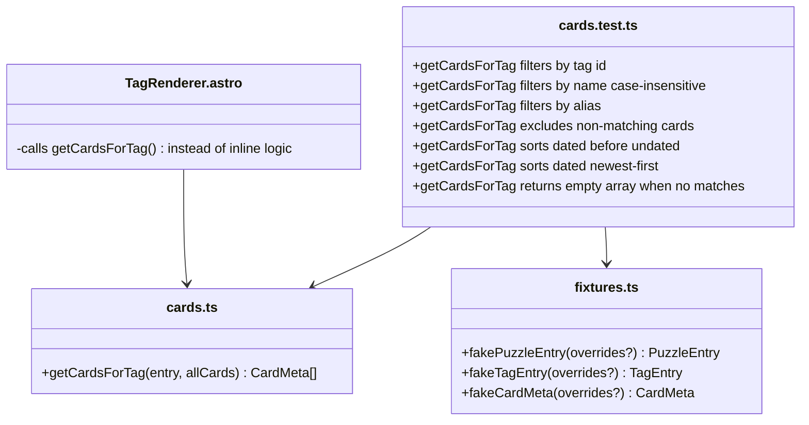
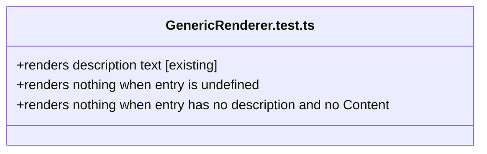
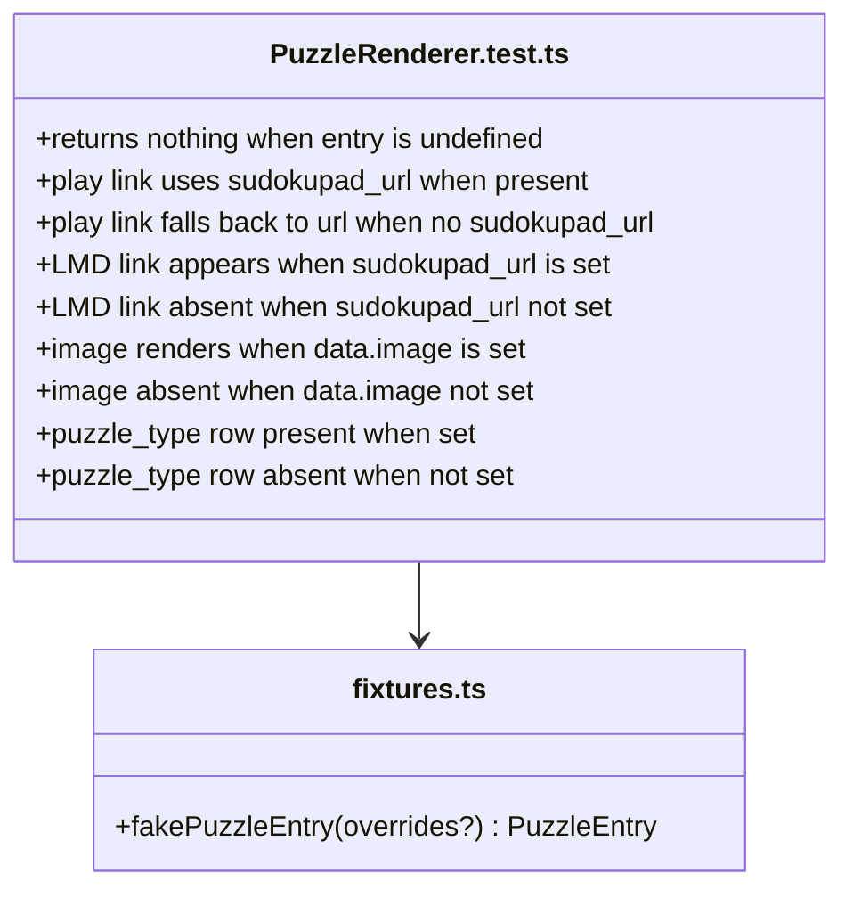
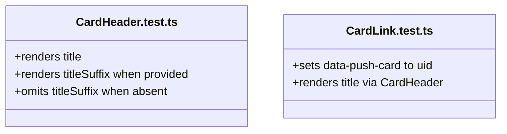

# Feature: Backfill Tests

**Status:** IN PROGRESS
**Created:** 2026-04-13
**Updated:** 2026-04-13

## Context

Now that the test infrastructure is in place, this plan adds regression coverage for existing built functionality. The goal is not exhaustive testing but a meaningful safety net: if a future change breaks the rendering logic of a component or the tag-filtering logic, a test should catch it. `StackNav` logic extraction is explicitly out of scope — it belongs to the `horizontal-card-stack` plan.

## Architecture Decisions

1. **Rename `_proof-of-life.test.ts` → `GenericRenderer.test.ts`** — the proof-of-life test is the first test in what should become the real test file for `GenericRenderer`. Renaming makes the intent clear.

2. **`TagRenderer`'s filtering/sorting logic extracted to `getCardsForTag()` in `cards.ts`** — the logic is pure (takes entry + allCards, returns filtered/sorted CardMeta[]). Extracting it satisfies the "pure logic must be extractable" invariant and makes it testable without touching `astro:content` at runtime. `TagRenderer.astro` calls the function instead of inlining the logic.

3. **No `TagRenderer` component test** — the component calls `getAllCards()` at render time, which hits `astro:content`'s `getCollection()`. Mocking this through the Container API is unverified and out of scope. The extracted pure logic is sufficient regression coverage.

4. **Fixtures extended with per-component factories** — `fakePuzzleEntry`, `fakeTagEntry`, and `fakeCardMeta` added to `src/test/fixtures.ts`. Each factory takes optional overrides and returns the minimal shape required by the component or function under test.

5. **Test focus: rendering paths and logic branches, not visual output** — assertions target presence/absence of elements and key attribute values (e.g. `data-push-card`, `href`), not CSS classes or layout.

## System Diagram

## Structure

### New Files

- [ ] `src/components/card-renderers/GenericRenderer.test.ts`
  *(rename from `_proof-of-life.test.ts`)*
  - [ ] `renders description text` — existing proof-of-life test (keep)
  - [ ] `renders nothing when entry is undefined` — pass `entry: undefined`, assert empty output
  - [ ] `renders nothing when entry has no description and no Content` — `fakeEntry({})`, `Content: undefined`

- [ ] `src/components/card-renderers/PuzzleRenderer.test.ts`
  - [ ] `returns nothing when entry is undefined` — pass `entry: undefined`
  - [ ] `play link uses sudokupad_url when present` — assert `href` equals `sudokupad_url`
  - [ ] `play link falls back to url when no sudokupad_url` — assert `href` equals `url`
  - [ ] `LMD link appears when sudokupad_url is set` — assert `.puzzle-lmd-link` present
  - [ ] `LMD link absent when sudokupad_url not set` — assert `.puzzle-lmd-link` absent
  - [ ] `image renders when data.image is set` — assert `` present with correct `alt`
  - [ ] `image absent when data.image not set` — assert no ``
  - [ ] `puzzle_type row present when set` — assert `<dt>` contains "Type"
  - [ ] `puzzle_type row absent when not set` — assert no "Type" dt

- [ ] `src/components/CardHeader.test.ts`
  - [ ] `renders title` — assert title text appears in output
  - [ ] `renders titleSuffix when provided` — assert suffix text appears
  - [ ] `omits titleSuffix when absent` — assert no extra text after title

- [ ] `src/components/CardLink.test.ts`
  - [ ] `sets data-push-card to uid` — assert attribute value equals uid
  - [ ] `renders title via CardHeader` — assert title text appears in output

### Modified Files

- [ ] `src/lib/cards.ts`
  - Changes:
    - [ ] Add `export function getCardsForTag(entry: { id: string; data: { name: string; aliases: string[] } }, allCards: CardMeta[]): CardMeta[]` — extracts filtering (by id, name, aliases — case-insensitive) and date-descending sort from `TagRenderer`

- [ ] `src/lib/cards.test.ts`
  - Changes:
    - [ ] `getCardsForTag: filters cards matching tag id` — card with matching tag id included
    - [ ] `getCardsForTag: filters by name (case-insensitive)` — tag name match works regardless of case
    - [ ] `getCardsForTag: filters by alias` — alias match includes card
    - [ ] `getCardsForTag: excludes non-matching cards` — card with no matching tags excluded
    - [ ] `getCardsForTag: sorts dated cards before undated` — undated cards go last
    - [ ] `getCardsForTag: sorts dated cards newest-first` — more recent date comes first
    - [ ] `getCardsForTag: returns empty array when no matches` — empty allCards → []

- [ ] `src/components/card-renderers/TagRenderer.astro`
  - Changes:
    - [ ] Import `getCardsForTag` from `../../lib/cards`
    - [ ] Replace inline filtering/sorting with `getCardsForTag(entry, allCards)`
    - [ ] Remove inline `canonicals` Set construction (moved into `getCardsForTag`)

- [ ] `src/test/fixtures.ts`
  - Changes:
    - [ ] Add `fakePuzzleEntry(overrides?)` — returns minimal object satisfying `PuzzleRenderer`'s `Props['entry']` shape (`title`, `difficulty`, `date`, `url` required; `image`, `puzzle_type`, `sudokupad_url` optional)
    - [ ] Add `fakeTagEntry(overrides?)` — returns minimal object satisfying `TagRenderer`'s `Props['entry']` shape (`id`, `data.name`, `data.aliases` required; `data.description` optional)
    - [ ] Add `fakeCardMeta(overrides?)` — returns minimal `CardMeta` object for use in `getCardsForTag` tests

## Dependencies

- **`src/lib/cards.ts`** — `getCardsForTag` added; `CardMeta` type already exported.
- **`src/components/card-renderers/TagRenderer.astro`** — calls `getCardsForTag` instead of inline logic; `getAllCards()` call unchanged.
- **`src/test/fixtures.ts`** — extended with new factory functions.
- **`add-testing-support` plan** — prerequisite; already complete.

## Sub-Features

### SF1 — Foundation: Fixtures + `getCardsForTag` extraction

**Status:** DONE
**Depends on:** —
**Acceptance test:** no

Files:
- `src/test/fixtures.ts` — add `fakePuzzleEntry`, `fakeTagEntry`, `fakeCardMeta`
- `src/lib/cards.ts` — add `getCardsForTag()`
- `src/components/card-renderers/TagRenderer.astro` — refactor to call `getCardsForTag`
- `src/lib/cards.test.ts` — 7 new tests for `getCardsForTag`

Automated tests: unit tests for `getCardsForTag` covering tag-id match, name match (case-insensitive), alias match, exclusion, date-desc sort, dated-before-undated sort, empty result.

---

### SF2 — GenericRenderer tests

**Status:** DONE
**Depends on:** —
**Acceptance test:** no

Files:
- `src/components/card-renderers/GenericRenderer.test.ts` *(rename from `_proof-of-life.test.ts`)*

Automated tests: 3 tests — existing proof-of-life test + `renders nothing when entry is undefined` + `renders nothing when entry has no description and no Content`.

---

### SF3 — PuzzleRenderer tests

**Status:** IMPLEMENTING
**Depends on:** SF1 (for `fakePuzzleEntry`)
**Acceptance test:** no

Files:
- `src/components/card-renderers/PuzzleRenderer.test.ts`

Automated tests: 9 tests covering undefined-entry guard, sudokupad_url/url fallback, LMD link presence/absence, image presence/absence, puzzle_type row presence/absence.

---

### SF4 — CardHeader + CardLink tests

**Status:** TODO
**Depends on:** —
**Acceptance test:** no

Files:
- `src/components/CardHeader.test.ts`
- `src/components/CardLink.test.ts`

Automated tests: 3 CardHeader tests (title, titleSuffix present/absent) + 2 CardLink tests (data-push-card attribute, title via CardHeader).

---

## Draft Split

### Dependency flow

---

### SF1 implementation

---

### SF2 implementation

---

### SF3 implementation

---

### SF4 implementation

## Notes

- 2026-04-13: Plan created. Scope: regression coverage for all built components except StackNav (deferred to horizontal-card-stack). TagRenderer component test skipped — getAllCards() hits astro:content at runtime; pure logic extracted to getCardsForTag() in cards.ts instead. Status → ARCHITECTURE.
- 2026-04-13: Review passed — architecture, principles, codebase opportunities (2026-04-13). Hardcoded colors in CardHeader/CardLink noted but left for light-dark-mode plan. Diagram gap fixed: fakeTagEntry → cards.test.ts connection added. Status → SPLITTING.
- 2026-04-13: Split approved — 4 SFs, all automated-only. SF1→SF3 dependency (fakePuzzleEntry). Status → IN PROGRESS.
