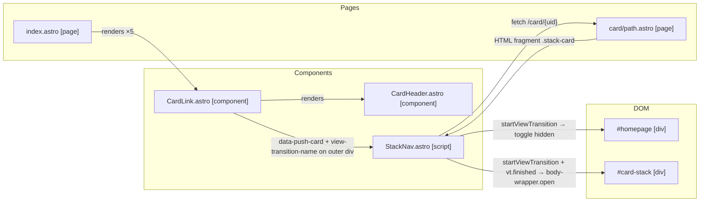

# Feature: Front Page Panel Links + Card Transition Animations

**Status:** COMPLETE
**Created:** 2026-04-11
**Updated:** 2026-04-11 (split approved)

## Context

The homepage currently shows the 5 panel cards (who/what/why/when/where) as an accordion — clicking expands content inline. This should instead show them as clickable card-shaped links that push the card onto the stack. Opening a card should animate: the clicked panel link morphs into the full card while everything else fades out. Closing the top-level card reverses the animation, returning to the homepage. A new reusable `CardLink` component handles both the homepage panel links and in-card push links (e.g., related project links).

## Architecture Decisions

1. **New `CardLink` component** — replaces both accordion panel summaries and existing `[data-push-card]` elements. Renders a clickable `div.card-link[data-push-card]` with a `CardHeader` inside. The `view-transition-name` is set on the outer `div.card-link` (not on the inner `CardHeader`) so the whole element participates in the morph.

2. **View Transitions API for animations** — `document.startViewTransition()` wraps `showStack()` / `showHomepage()` DOM mutations. The named outer container morphs position between panel link and stack card. Progressive fallback: instant toggle for unsupported browsers.

3. **VT name on outer container, body grows separately** — The `view-transition-name` (derived as `'panel-' + uid.replace(/\//g, '-')`) is set on the `.card-link` outer div (old state) and on the `.stack-card` outer div (new state). The `stack-card-body` is hidden at VT snapshot time via a `body-wrapper` collapsed to `0fr`, so the VT sees identically-sized bordered boxes in old and new states (making the crossfade imperceptible). After `vt.finished`, the body-wrapper opens via a CSS grid `0fr → 1fr` transition, growing the card border and content together. On close, the body-wrapper collapses first (CSS transition), then VT morphs the header back.

4. **`body-wrapper` + inner padding pattern** — `stack-card-body` must have no padding (padding on a grid-child prevents `0fr` from collapsing to zero height). Instead, an inner `div.stack-card-body-inner` carries the padding. This pattern applies to all card renderer components.

5. **Two distinct VT names for open vs close** — `panel-card-open` is set on both elements when opening; `panel-card-close` when closing. This avoids class-toggle timing ambiguity and allows distinct `::view-transition-*` CSS rules per direction if needed.

6. **Remove source-card prepend behaviour** — the current `pushCard(url, sourceUid)` logic that prepended the source accordion panel as a collapsed card is dropped. From the homepage (stack empty), the clicked card becomes the sole card in the stack; close returns directly to the homepage.

7. **Remove accordion entirely** — `index.astro` drops the `<details>`/`<summary>` markup and all accordion styles. The homepage renders only a `<nav class="panel-links">` of 5 `CardLink` components. No inline content is pre-rendered on the homepage.

8. **CardLink styling is context-sensitive** — `CardLink` provides structure and behaviour; appearance is controlled by the parent context (`.panel-links .card-link` for homepage entries, inherited defaults for in-card usage).

9. **Border fix: `.stack-card > .card-header`** — `CardHeader` carries a full border for standalone use (panel links). Inside `.stack-card` the outer card border covers three sides, so `.stack-card > .card-header` overrides to `border: none; border-bottom: var(--border-width) solid var(--color-border)`. This also makes the VT old/new screenshots visually identical (both look like a bordered box with a striped header), making the crossfade imperceptible.

## System Diagram



## Structure

### New Files

- [ ] `src/components/CardLink.astro`
  - Props: `uid: string`, `title: string`, `titleSuffix?: string`
  - Renders:
    ```astro
    <div
      class="card-link"
      data-push-card={`/card/${uid}`}
    >
      <CardHeader {title} {titleSuffix} />
    </div>
    ```
  - Note: `view-transition-name` is injected dynamically by StackNav JS (not set in HTML) to avoid name conflicts when multiple CardLinks are on screen
  - Scoped style: `cursor: pointer`, hover background, no extra padding

### Modified Files

- [ ] `src/pages/index.astro`
  - Changes:
    - [ ] Remove `render()` calls and `rendered` map (no inline content needed)
    - [ ] Replace `<div class="accordion">` + `<details>` markup with `<nav class="panel-links">` containing one `<CardLink>` per panel
    - [ ] Remove all accordion-specific scoped CSS
    - [ ] Add `.panel-links` and `.panel-links .card-link` scoped styles
    - [ ] Import `CardLink` component

- [ ] `src/components/StackNav.astro` (the `<script>` block)
  - Changes:
    - [ ] Update top-of-file comment: "toggles between panel links and stack" (accordion removed)
    - [ ] Remove `sourceUid` parameter and the block that prepends a collapsed source card in `pushCard`
    - [ ] In `pushCard(url)`:
      - Feature-detect: `if (document.startViewTransition)` — use VT path; else call `showStack()` directly (instant fallback)
      - VT path: get clicked `.card-link` element; pre-fetch card; set `view-transition-name: panel-card-open` on both the clicked `.card-link` and the fetched `.stack-card`; call `startViewTransition`; after `vt.finished` clear names and call `card.querySelector('.body-wrapper').classList.add('open')`
    - [ ] In close button handler:
      - When `prev` exists: existing behaviour (expand prev, updateUrl) — no VT
      - When no `prev` (last card, returning to homepage): call `bodyWrapper.classList.remove('open')`; wait for `transitionend`; find matching `card-link` via `document.querySelector('.card-link[data-push-card="/card/${uid}"]')`; set `view-transition-name: panel-card-close` on both `.stack-card` and the matching `.card-link`; call `startViewTransition` with `showHomepage()`; after `finished` clear names. Instant fallback if no `startViewTransition`.
    - [ ] Remove the "exclusive accordion" block at the bottom
    - [ ] In `tag:` click handler: remove entire `sourceUid` variable declaration and the second argument from `pushCard` call

- [ ] `src/styles/global.css`
  - Changes:
    - [ ] Add `::view-transition-group(panel-card-open)` and `::view-transition-group(panel-card-close)` rules: `z-index: 1; animation-duration: 300ms; animation-timing-function: ease-in-out`
    - [ ] Add `::view-transition-old/new(panel-card-open/close)` duration rules
    - [ ] Add `::view-transition-old/new(root)` duration rules
    - [ ] Add `.card-link` base styles: `cursor: pointer`, display block
    - [ ] Add `.body-wrapper` styles: `display: grid; grid-template-rows: 0fr; transition: grid-template-rows 300ms ease-out`
    - [ ] Add `.body-wrapper.open` style: `grid-template-rows: 1fr`
    - [ ] Add `.stack-card-body` update: remove `padding`, add `overflow: hidden; min-height: 0`
    - [ ] Add `.stack-card-body-inner` style: `padding: var(--space-lg)`
    - [ ] Add `.stack-card > .card-header` override: `border: none; border-bottom: var(--border-width) solid var(--color-border)`

- [ ] `CLAUDE.md`
  - Add a new `## Architecture` section with two subsections documenting patterns introduced by this feature:
    - **Card body expand/collapse**: the `body-wrapper` grid trick (`display: grid; grid-template-rows: 0fr → 1fr` with `overflow: hidden; min-height: 0` on the grid child and padding on an inner `.stack-card-body-inner` element). Mandatory for any future card renderer that needs animated expand/collapse.
    - **View Transition names**: never set `view-transition-name` in HTML (conflicts when multiple cards are visible). Inject via JS before `startViewTransition()` and clear after `.finished`. Use distinct names per direction: `panel-card-open` and `panel-card-close`.
  - Should be added alongside the StackNav implementation step (where the patterns are first introduced).

- [ ] `src/pages/card/[...path].astro`
  - Changes:
    - [ ] Wrap the existing `<div class="stack-card-body">` in an outer `<div class="body-wrapper">`
    - [ ] Add `<div class="stack-card-body-inner">` inside `.stack-card-body` (padding moves here from global `.stack-card-body` rule)
  - Note: renderer components (`GenericRenderer`, `TagRenderer`, `PuzzleRenderer`) require no changes — they output raw content; padding is solely from `card/[...path].astro` via the global `.stack-card-body` rule

## Dependencies

- **`CardHeader.astro`** — used inside `CardLink`; no changes needed to the component itself
- **`StackNav.astro`** — handles all push/pop/transition logic; sole consumer of `data-push-card` and VT calls
- **`/card/[...path].astro`** — fetch target for card HTML; receives `body-wrapper` + `body-inner` wrapping (the only place these wrappers are added)
- **`GenericRenderer.astro`, `TagRenderer.astro`, `PuzzleRenderer.astro`** — no changes required; raw content is wrapped by `card/[...path].astro`

## Unknowns & Experiments

### view-transition-name on dynamically-fetched HTML

- **Unknown**: Does injecting `view-transition-name` on a freshly-fetched (but not yet appended) DOM node, then appending it inside `startViewTransition()`, produce a clean position morph?
- **Risk**: Morph falls back to crossfade if name not recognised on new element.
- **Experiment**: Minimal test page — inject name on detached node, append inside VT callback, observe.
- **Result**: CONFIRMED — setting `element.style.viewTransitionName` on a detached node before appending inside `startViewTransition()` works correctly. The VT captures the name from the new DOM state after the callback.
- **Impact**: None. Architecture unchanged.

### Default root crossfade behaviour with named elements

- **Unknown**: Does the default VT crossfade look good alongside the named-element morph, or does it produce artefacts?
- **Risk**: May need custom CSS overrides.
- **Experiment**: Build minimal test page, observe crossfade and morph together.
- **Result**: CONFIRMED with significant findings — the architecture evolved substantially during experimentation:
  - VT name must be on the **outer container** (`.card-link` / `.stack-card`), not on `.card-header`. Naming only the header causes the card body to appear at its final position rather than growing with the header.
  - The VT crossfade between old and new screenshots creates the size-morph illusion. To make it imperceptible, old and new must look visually identical — achieved by collapsing `stack-card-body` to `0fr` before the VT snapshot and by fixing the double-border issue (`.stack-card > .card-header` removes three sides of its own border since the outer card border covers them).
  - Body grow animation must run **after** `vt.finished` as a real CSS transition on the live DOM (not as a VT pseudo-element animation). CSS animations on live elements run while hidden under VT pseudo-elements.
  - The `0fr` body collapse requires padding to be on an **inner** element, not the grid child (padding is not collapsed by `min-height: 0`).
  - Two distinct VT names (`panel-card-open` / `panel-card-close`) eliminate the need for a class-toggle timing hack.
- **Impact**: Architecture decisions 3–5 and 9 added; Structure section substantially updated.

## Sub-Features

### Sub-Feature 1: Replace Accordion + CardLink
**Status:** DONE
**Depends on:** none
**Branch:** astro-rebuild
**Test Cases:**
- Manual browser test:
  - [ ] Homepage renders 5 panel links (not accordion)
  - [ ] Clicking a panel link opens the card (instant toggle, no animation)
  - [ ] Closing the last card returns to homepage (instant)
  - [ ] Tag links still push cards correctly
  - [ ] Card body renders without broken layout (no double-border, correct padding)
**Acceptance:** Homepage shows 5 styled clickable panel links; clicking any opens its card and closing it returns to homepage — all instant, no JS errors in console.

**Structure items:**
- `src/components/CardLink.astro`
  - [ ] New component: renders `div.card-link[data-push-card]` with `CardHeader` inside
  - [ ] Props: `uid: string`, `title: string`, `titleSuffix?: string`
  - [ ] Scoped styles: `cursor: pointer`, hover background
- `src/pages/index.astro`
  - [ ] Remove `render()` calls and `rendered` map
  - [ ] Replace `<div class="accordion">` + `<details>` markup with `<nav class="panel-links">` containing one `<CardLink>` per panel
  - [ ] Remove all accordion-specific scoped CSS
  - [ ] Add `.panel-links` and `.panel-links .card-link` scoped styles
  - [ ] Import `CardLink` component
- `src/pages/card/[...path].astro`
  - [ ] Wrap existing `<div class="stack-card-body">` in `<div class="body-wrapper">`
  - [ ] Add `<div class="stack-card-body-inner">` inside `.stack-card-body`
- `src/styles/global.css`
  - [ ] Add `.card-link` base styles: `cursor: pointer`, display block
  - [ ] Add `.body-wrapper` styles: `display: grid; grid-template-rows: 0fr; transition: grid-template-rows 300ms ease-out`
  - [ ] Add `.body-wrapper.open` style: `grid-template-rows: 1fr`
  - [ ] Update `.stack-card-body`: remove `padding`, add `overflow: hidden; min-height: 0`
  - [ ] Add `.stack-card-body-inner` style: `padding: var(--space-lg)`
  - [ ] Add `.stack-card > .card-header` override: `border: none; border-bottom: var(--border-width) solid var(--color-border)`
- `src/components/StackNav.astro`
  - [ ] Update top-of-file comment: "toggles between panel links and stack"
  - [ ] Remove `sourceUid` parameter and source-card prepend block from `pushCard`
  - [ ] Remove "exclusive accordion" block
  - [ ] Remove `sourceUid` variable from `tag:` click handler

### Sub-Feature 2: View Transition Animations + Documentation
**Status:** DONE
**Depends on:** Sub-Feature 1
**Branch:** astro-rebuild
**Test Cases:**
- Manual browser test (Chrome/Edge):
  - [ ] Clicking a panel link shows morph animation (link grows into card)
  - [ ] Closing the last card shows reverse morph (card shrinks back to panel link)
  - [ ] Body content grows in after `vt.finished` (not during VT)
- Manual browser test (Firefox/Safari):
  - [ ] Clicking a panel link opens card instantly (no animation, no errors)
  - [ ] Closing last card returns to homepage instantly
**Acceptance:** In a VT-capable browser, panel link morphs into full card on open and back on close. In non-VT browsers, instant toggle. No console errors in either case.

**Structure items:**
- `src/components/StackNav.astro`
  - [ ] In `pushCard(url)`: feature-detect `document.startViewTransition`; VT path sets `view-transition-name: panel-card-open` on clicked `.card-link` and fetched `.stack-card`, calls `startViewTransition`, after `vt.finished` clears names and calls `body-wrapper.classList.add('open')`; instant fallback calls `showStack()` directly
  - [ ] In close button handler (no `prev` case): call `bodyWrapper.classList.remove('open')`; wait for `transitionend`; find matching `.card-link[data-push-card="/card/${uid}"]`; set `view-transition-name: panel-card-close` on `.stack-card` and matching `.card-link`; call `startViewTransition` with `showHomepage()`; after `finished` clear names; instant fallback if no `startViewTransition`
- `src/styles/global.css`
  - [ ] Add `::view-transition-group(panel-card-open)` and `::view-transition-group(panel-card-close)` rules: `z-index: 1; animation-duration: 300ms; animation-timing-function: ease-in-out`
  - [ ] Add `::view-transition-old/new(panel-card-open/close)` duration rules
  - [ ] Add `::view-transition-old/new(root)` duration rules
- `CLAUDE.md`
  - [ ] Add `## Architecture` section documenting body-wrapper grid pattern
  - [ ] Add VT naming convention: never set in HTML, inject via JS, clear after `.finished`, distinct names per direction

## Notes

- 2026-04-11: Initial architecture discussion. Accordion replaced with 5 `CardLink` panel links. `CardLink` is generic — used on homepage and inside card bodies for in-stack pushes. View Transitions API provides morph animation; progressive fallback is instant toggle. Source-card prepend behaviour removed. Two experiments needed before implementation.
- 2026-04-11: All experiments resolved through iterative test-page exploration. Architecture confirmed with significant refinements: VT name on outer container, body grows via CSS grid trick after `vt.finished`, border fix required. Ready for plan review.
- 2026-04-11: Split approved. 2 sub-features: SF1 structural changes (CardLink, homepage, body-wrapper, StackNav cleanup), SF2 VT animations + docs. Status → IN PROGRESS.
- 2026-04-11: sf-1 (Replace Accordion + CardLink) passed. body-wrapper open class must be managed by expandCard/collapseCard for instant-toggle mode.
- 2026-04-11: sf-2 (View Transition Animations + Documentation) passed. Several fixes during build: async click handler required for await in close VT path; startViewTransition needs runtime feature-detection via cast; panel-links styles moved to global.css so injected homepage renders correctly; homepage fetched on close from direct card URL to enable reverse VT. Status → COMPLETE.
- 2026-04-11: Plan review complete. Corrections applied: (1) renderer components removed from Modified Files — only `card/[...path].astro` needs the body-wrapper/body-inner wrapping; (2) StackNav close handler clarified — VT animation only when returning to homepage (no `prev` case); (3) missing lookup selectors added (`.card-link[data-push-card="..."]` for matching, `card.querySelector('.body-wrapper')` for grow target); (4) `startViewTransition` feature-detection guard made explicit; (5) `tag:` click handler — full `sourceUid` variable removed as dead code; (6) StackNav top-of-file comment updated. New CLAUDE.md `## Architecture` section added to plan, documenting `body-wrapper` pattern and VT naming convention. Status → SPLITTING.
