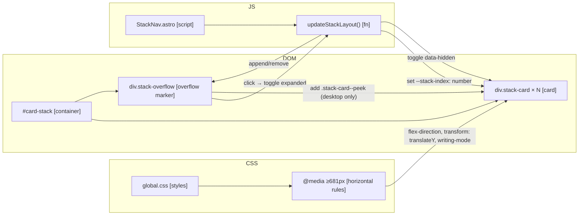

# Feature: Horizontal Card Stack on Desktop

## Context

The card stack currently renders vertically on all screen sizes — collapsed cards appear as slim horizontal strips stacked top-to-bottom, with the active card expanded in place. On wider viewports this wastes horizontal space and doesn't use the screen well. This feature introduces a desktop-only horizontal layout where:

- Collapsed cards become slim **vertical** strips arranged left-to-right (with rotated header text)
- The active card fills the remaining horizontal space
- Cards are staggered with a slight vertical offset — the first-navigated card (bottom of the stack, leftmost) sits highest; each subsequent card drops down slightly, giving the visual impression of fanning playing cards
- The stack breaks out of the existing `--max-width` constraint to fill the full viewport width

Additionally, the stack needs a universal overflow mechanism (mobile and desktop): once more than 3 collapsed cards would be visible, the middle ones collapse into a `...` slot that can be expanded in place to reveal and navigate the hidden cards. On desktop, expanding `...` also shrinks the active card into a slightly larger header so it remains visible and tappable for a quick return. On mobile, the active card is untouched during `...` expansion.

## Architecture Decisions

1. **CSS media query breakpoint at 681px** — matches the site's `--max-width`. Below, layout is vertical (current behaviour, unchanged). At and above, layout is horizontal. No JS breakpoint detection; pure CSS.

2. **Horizontal layout via `flex-direction: row` at breakpoint** — the existing `#card-stack` flex container swaps direction at the breakpoint. Collapsed cards become `flex-shrink: 0` fixed-width strips (exact width TBD during experiment); the active card takes `flex: 1`. The `max-width` cap on `#card-stack` is removed at the breakpoint so it fills the viewport.

3. **Rotated header via `writing-mode: vertical-rl`** — in horizontal mode, `.stack-card--collapsed > .card-header` uses `writing-mode: vertical-rl` so the title reads top-to-bottom inside the slim vertical strip. This is semantically correct (text remains real text — accessible, selectable, flows naturally) and avoids the manual width/height compensation that `transform: rotate()` would require. The only risk is the `.card-header` flex main-axis following writing mode; if that breaks the layout during experiment, fall back to `transform: rotate(-90deg)` with a fixed-size wrapper.

4. **Stack index via CSS custom property, stagger via `translateY`** — JS sets `--stack-index` (0, 1, 2, …) on each card after every stack mutation. CSS applies `transform: translateY(calc(var(--stack-index) * <N>px))` on desktop only. The first card (index 0, leftmost) has zero offset and sits highest; each successive card drops. Mobile sets no offset. The magnitude per step is tuned during experiment.

5. **Border direction inverts at breakpoint** — the existing `.stack-card + .stack-card { border-top: none }` rule applies in vertical mode. At the desktop breakpoint, adjacent cards share a vertical edge instead, so `border-top: none` is reset and `border-left: none` applies. This keeps the single-border look in both orientations.

6. **Overflow mechanism — threshold of 3 collapsed cards, both orientations** — a `updateStackLayout()` function runs on every stack mutation. If the number of collapsed cards exceeds 3, the middle cards are flagged `data-hidden` (hidden via CSS) and a synthetic `.stack-overflow` element is inserted into the stack DOM in their place. The overflow element participates in layout like a normal card (occupies one slot, gets its own `--stack-index`, staggers normally on desktop).

7. **Which collapsed cards stay visible when overflowing** — when count > 3, show exactly two cards + the overflow marker, in order: `[first] [...] [last]`. `first` is the entry point (the card the stack was initiated from), `last` is the most recent collapsed card (one step back from the active card). Total: 3 slots. This gives "where I started" + "immediate previous" with the middle path accessible via overflow expansion. Simpler state than trying to keep more context visible.

8. **Overflow element is a real DOM node, not a pseudo-element** — `.stack-overflow` is appended/removed via JS. It listens for clicks and manages its own expanded state. On expansion, it shows the hidden collapsed cards as a list inside itself (desktop) or in an inline panel (mobile). Arrows for pagination appear only if the hidden count exceeds what fits.

9. **Desktop overflow expansion shrinks the active card** — when `.stack-overflow` enters expanded state on desktop, the active card receives a class (`.stack-card--peek`) that collapses its body but leaves its header at a slightly larger size than normal collapsed cards (so it's a visible "return here" target). Clicking the peeked active card returns it to expanded state and collapses the overflow. Mobile does not apply `.stack-card--peek` — the active card stays as-is.

10. **Overflow navigation reuses existing collapsed-card click behaviour** — tapping a card inside the expanded overflow collapses the overflow, expands the selected card (via the existing "click collapsed card → activate" path), and calls `updateStackLayout()`. No new push/pop logic.

11. **Keep mobile behaviour identical outside of overflow** — below 681px, the only behavioural change from today is the overflow mechanism. Vertical stacking, padding, `scrollIntoView`, and existing close/push behaviour stay as-is.

12. **`updateStackLayout()` is called after every mutation** — `pushCard`, `collapseCard`, `expandCard`, `initFromUrl`, and the close-button handler all trigger a single call. It sets `--stack-index` on every card, computes which (if any) should be hidden for overflow, and inserts/removes the `.stack-overflow` element.

## System Diagram

## Structure

### Modified Files

- [ ] `src/styles/global.css`
  - Add `@media (min-width: 681px)` block with:
    - `#card-stack` — `flex-direction: row`, `max-width: none`, `align-items: flex-start`
    - `.stack-card` — `transform: translateY(calc(var(--stack-index, 0) * <stagger-px>))`
    - `.stack-card--collapsed` — fixed width (e.g. 48px), `flex-shrink: 0`
    - `.stack-card--collapsed > .card-header` — vertical writing mode, rotated title
    - `.stack-card--active` — `flex: 1`
    - `.stack-card + .stack-card` — reset `border-top`, apply `border-left: none`
    - `.stack-card--peek` — shrinks active card to slightly-larger-than-collapsed width, hides body
  - Add `.stack-overflow` base styles (both orientations): slim strip showing `⋯` glyph, cursor pointer
  - Add `.stack-overflow--expanded` expanded panel styles (list of hidden cards)
  - Add `.stack-card[data-hidden]` rule: `display: none`

- [ ] `src/components/StackNav.astro` (the `<script>` block)
  - Add `updateStackLayout()` function:
    - Sets `--stack-index` on every `.stack-card` based on its DOM position
    - Counts collapsed cards; if > 3, flags middle ones `data-hidden` and inserts `.stack-overflow` between visible collapsed cards
    - Removes `.stack-overflow` and clears `data-hidden` if count ≤ 3
  - Call `updateStackLayout()` at the end of: `pushCard` (both VT and instant paths), close handler (both `prev` and last-card paths), `initFromUrl`, and the on-load hydration block
  - Add overflow click handler (delegated via the existing `cardStack` click listener):
    - On click of `.stack-overflow`: toggle `.stack-overflow--expanded` class; if expanding and desktop (matchMedia `(min-width: 681px)`), add `.stack-card--peek` to the active card; if collapsing, remove it
  - Add card click handler inside expanded overflow: selecting a hidden card triggers the existing "click collapsed card → activate" path, then calls `updateStackLayout()` to rebuild
  - Optional arrow pagination inside overflow (only if hidden count > what fits) — scope and mechanics decided during experiment

### Unchanged Files

- `src/pages/index.astro`, `src/pages/card/[...path].astro`, `src/components/CardLink.astro`, `src/components/CardHeader.astro`, card renderers — no changes expected.

## Dependencies

- **`StackNav.astro`** — the only place that mutates the card stack; owns `updateStackLayout`
- **`CardHeader.astro`** — the header component whose flex layout is rotated at breakpoint; may need tweaks discovered during experiment
- **`global.css`** — all layout, stagger, and overflow styling
- **View Transitions** — must continue to work across both orientations and through the overflow state (a card in the hidden set should still be morph-able if it becomes the target, but typically the VT only fires for the homepage transition, not for intra-stack clicks, so this is low-risk)

## Unknowns & Experiments

### `writing-mode: vertical-rl` on the existing `.card-header` flex layout

- **Unknown**: The existing `.card-header` uses `display: flex; align-items: center; justify-content: space-between` with an inner title span and a slot. Applying `writing-mode: vertical-rl` to a flex container has specific implications (flex main axis becomes vertical in vertical writing mode). Can we keep the same `CardHeader` component and just flip writing mode, or does the horizontal layout require a restructured header variant?
- **Risk**: If the rotated header looks broken or unreadable, we'd need a dedicated collapsed-horizontal header variant — larger structural change.
- **Experiment**: Create a minimal test page with a single `.stack-card.stack-card--collapsed` inside a horizontal `#card-stack`, apply `writing-mode: vertical-rl` (or alternatively `transform: rotate(-90deg)` with compensating width/height), and observe: does the title read bottom-to-top cleanly? Does the striped background render correctly rotated? Is the border visually consistent with the active card's header border?
- **Result**: CONFIRMED — `writing-mode: vertical-rl` works cleanly. Title reads top-to-bottom, looks good at the 48px strip width. Stripes must be reoriented to `to right` direction in this mode. Title needs `background: var(--color-surface)` to sit above stripes. Collapsed card needs `display: flex; flex-direction: column` so header fills height via `flex: 1` (not driven by text length). Header `border-bottom` must be removed in horizontal mode (card outer border already provides it).
- **Impact**: None. Architecture Decision 3 stands as-is.

### Stagger with `translateY` on flex children

- **Unknown**: `translateY` is purely visual — it doesn't affect flex layout. With a staggered offset that grows by index, does the visual result look like fanning cards, or does it create awkward overlaps with the active card (especially at the right edge) or with each other when the stagger magnitude is large?
- **Risk**: The stagger might clip, overlap the active card's header, or look "jittery" as cards are added/removed and indices shift.
- **Experiment**: Render a test page with 2, 3, 4, and 5 collapsed cards + 1 active card, varying the stagger magnitude (2, 4, 6, 8px per step). Observe at typical desktop viewport widths. Determine: what's the right magnitude? Does the last collapsed card's header ever visually touch the active card's header? Does the staggered stack extend beyond `#card-stack`'s content box?
- **Result**: _pending_
- **Impact**: Determines the exact `--stack-index` multiplier in Architecture Decision 4, and whether any additional `padding-top` on `#card-stack` or `margin-top` compensation is needed.

### Overflow `...` element behaviour at large stack sizes

- **Unknown**: The visible-cards selection rule ("first + ... + last two"), the expanded panel's visual design, the shrink-active-to-peek transition on desktop, the mobile inline expansion, and optional arrow pagination are all underspecified. The current test content doesn't have enough navigation depth to produce >3 collapsed cards naturally, so the design needs synthetic stress testing.
- **Risk**: Without a concrete design explored interactively, we can't commit to the layout or the state machine (collapsed overflow ↔ expanded overflow ↔ active card peek ↔ navigation). Guessing here will lead to rework during build.
- **Experiment**: Build a static test page or dev-only route that populates the stack with 5–10 synthetic collapsed cards + 1 active card. Prototype: (a) the collapsed `...` strip's look; (b) the expanded state layout on desktop and mobile separately; (c) the peek state on desktop (active card shrunk to slightly-wider-than-collapsed); (d) interaction flow: click overflow → expand → click a hidden card → activate it and collapse overflow; (e) whether arrow pagination is needed or if the expanded list simply scrolls. Capture screenshots/notes for each.
- **Result**: _pending_
- **Impact**: Refines Architecture Decisions 6–10 with concrete numbers, markup, and state transitions. May surface new decisions (e.g. whether overflow expansion should use a View Transition, whether the peek state needs its own VT name).

## Notes

- 2026-04-11: Initial architecture discussion. Desktop horizontal layout with 681px breakpoint, rotated collapsed cards, stagger via CSS custom property, universal overflow mechanism at 3-card threshold. Three experiments queued: writing-mode on header, stagger magnitude, overflow behaviour at scale.
- 2026-04-11: Open points decided: overflow visible-selection is `[first] [...] [last]` (2 cards + marker, simpler state); rotated header uses `writing-mode: vertical-rl` (semantic, accessible) with `transform` as fallback if flex layout breaks during experiment. Status → EXPERIMENTING. Run `/experiment horizontal-card-stack` to resolve the three unknowns before plan review.
