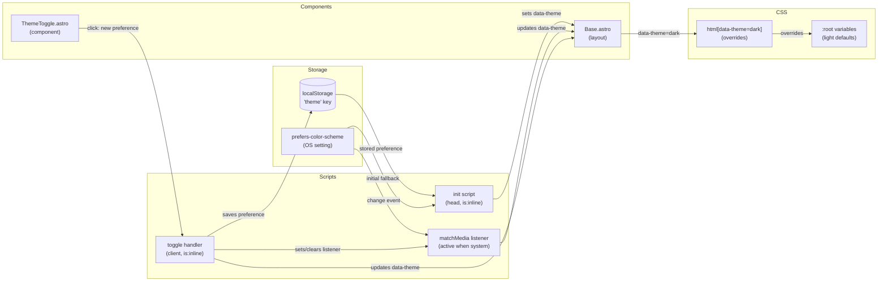

# Feature: Light / Dark Mode

**Status:** SPLITTING
**Created:** 2026-04-11
**Updated:** 2026-04-11

## Context

The site is currently light-mode only with all colors as CSS custom properties. Users expect sites to respect their OS color scheme preference. Adding light/dark mode with a manual override improves accessibility and user comfort, especially for readers on darker environments.

## Architecture Decisions

1. **`data-theme` attribute on `<html>` drives all CSS switching** — keeps CSS simple (`html[data-theme="dark"]` overrides), no JS required after init, and works with Astro's SSR/static output.

2. **Inline anti-FOUC script in `<head>`** — synchronously reads `localStorage` and `prefers-color-scheme` before first paint to set `data-theme`. Prevents flash of wrong theme. Uses Astro's `is:inline` directive.

3. **Three-state preference: `"light"` / `"dark"` / `"system"`** — localStorage stores `"light"`, `"dark"`, or is absent/`"system"`. When system, `data-theme` is set dynamically from `prefers-color-scheme` and a `matchMedia` change listener keeps it live.

4. **`data-theme` is always either `"light"` or `"dark"` in the DOM** — the CSS never needs to know about "system"; the JS resolves system → actual before setting the attribute.

5. **Three-button group toggle (fixed top-right)** — shows sun / monitor / moon as monochrome inline SVG icons using `currentColor`. Floats over content as a `position: fixed` element. Matches e-ink aesthetic (sharp, no radius, border).

6. **New `--color-bg-hover` variable** — replaces three hardcoded `#f0f0f0` / `background: white` occurrences in `global.css` and `CardHeader.astro`.

7. **Soft dark palette** — dark grey backgrounds with light grey text, not pure inversion.

## System Diagram

## Structure

### New Files

- [ ] `src/components/ThemeToggle.astro`
  - Three-button group: Sun / Monitor / Moon inline SVG icons
  - `position: fixed`, top-right corner
  - Active button indicated by filled/bold style (still monochrome)
  - `<script is:inline>` for click handler: updates `data-theme`, saves to localStorage, manages `matchMedia` listener
  - Reads `localStorage.getItem('theme')` on mount to determine initial active button (null/absent → System active)

### Modified Files

- [ ] `src/layouts/Base.astro`
  - Changes:
    - [ ] Add `<script is:inline>` in `<head>` for anti-FOUC theme init
    - [ ] Import and render `<ThemeToggle />` inside `<body>`
    - [ ] Add theme switching architecture note to `CLAUDE.md`

- [ ] `src/styles/global.css`
  - Changes:
    - [ ] Add `--color-bg-hover: #f0f0f0` to `:root`
    - [ ] Add `html[data-theme="dark"]` block with full dark palette:
      - `--color-bg: #1a1a1a`
      - `--color-surface: #242424`
      - `--color-bg-stripes: #888888`
      - `--color-border: #c0c0c0`
      - `--color-border-light: #555555`
      - `--color-text: #e0e0e0`
      - `--color-text-muted: #aaaaaa`
      - `--color-bg-hover: #2d2d2d`
    - [ ] Replace hardcoded `#f0f0f0` on lines ~333 and ~357 with `var(--color-bg-hover)`

- [ ] `src/components/CardHeader.astro`
  - Changes:
    - [ ] Replace `background: white` (line 37) with `var(--color-surface)`

- [ ] `src/components/CardLink.astro`
  - Changes:
    - [ ] Replace hardcoded `#f0f0f0` hover background (line 24) with `var(--color-bg-hover)`

## Dependencies

- `src/styles/global.css` — all color tokens live here; dark mode block extends existing `:root` pattern
- `src/layouts/Base.astro` — all pages use this layout; init script and toggle render once globally
- `prefers-color-scheme` media query API (browser standard, no polyfill needed)
- `localStorage` (browser standard)

## Notes

- 2026-04-11: Initial architecture. Three-state toggle (light/system/dark). Inline SVG icons with `currentColor`. Anti-FOUC inline script in `<head>`. Soft dark palette. No external dependencies.
- 2026-04-11: Review complete. Fixed toggle active state to read from localStorage (not data-theme). Made CardLink.astro a definite change. Added CLAUDE.md update as plan item. Status → SPLITTING.
