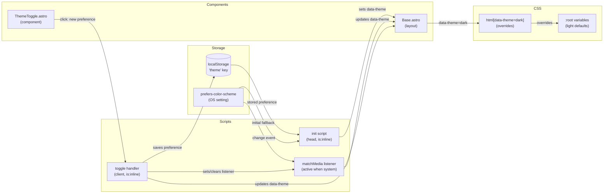

# Feature: Light / Dark Mode

**Status:** IN PROGRESS
**Created:** 2026-04-11
**Updated:** 2026-04-14

## Context

The site is currently light-mode only with all colors as CSS custom properties. Users expect sites to respect their OS color scheme preference. Adding light/dark mode with a manual override improves accessibility and user comfort, especially for readers on darker environments.

## Architecture Decisions

1. **`data-theme` attribute on `<html>` drives all CSS switching** — keeps CSS simple (`html[data-theme="dark"]` overrides), no JS required after init, and works with Astro's SSR/static output.

2. **Inline anti-FOUC script in `<head>`** — synchronously reads `localStorage` and `prefers-color-scheme` before first paint to set `data-theme`. Prevents flash of wrong theme. Uses Astro's `is:inline` directive.

3. **Three-state preference: `"light"` / `"dark"` / `"system"`** — localStorage stores `"light"`, `"dark"`, or is absent/`"system"`. When system, `data-theme` is set dynamically from `prefers-color-scheme` and a `matchMedia` change listener keeps it live.

4. **`data-theme` is always either `"light"` or `"dark"` in the DOM** — the CSS never needs to know about "system"; the JS resolves system → actual before setting the attribute.

5. **Three-button group toggle (fixed top-right)** — shows sun / monitor / moon as monochrome inline SVG icons using `currentColor`. Floats over content as a `position: fixed` element. Matches e-ink aesthetic (sharp, no radius, border).

6. **New `--color-bg-hover` variable** — replaces three hardcoded `#f0f0f0` / `background: white` occurrences in `global.css` and `CardHeader.astro`.

7. **Soft dark palette** — dark grey backgrounds with light grey text, not pure inversion.

## System Diagram

## Structure

### New Files

- [ ] `src/components/ThemeToggle.astro`
  - Three-button group: Sun / Monitor / Moon inline SVG icons
  - `position: fixed`, top-right corner
  - Active button indicated by filled/bold style (still monochrome)
  - `<script is:inline>` for click handler: updates `data-theme`, saves to localStorage, manages `matchMedia` listener
  - Reads `localStorage.getItem('theme')` on mount to determine initial active button (null/absent → System active)

### Modified Files

- [ ] `src/layouts/Base.astro`
  - Changes:
    - [ ] Add `<script is:inline>` in `<head>` for anti-FOUC theme init
    - [ ] Import and render `<ThemeToggle />` inside `<body>`
    - [ ] Add theme switching architecture note to `CLAUDE.md`

- [ ] `src/styles/global.css`
  - Changes:
    - [ ] Add `--color-bg-hover: #f0f0f0` to `:root`
    - [ ] Add `html[data-theme="dark"]` block with full dark palette:
      - `--color-bg: #1a1a1a`
      - `--color-surface: #242424`
      - `--color-bg-stripes: #888888`
      - `--color-border: #c0c0c0`
      - `--color-border-light: #555555`
      - `--color-text: #e0e0e0`
      - `--color-text-muted: #aaaaaa`
      - `--color-bg-hover: #2d2d2d`
    - [ ] Replace hardcoded `#f0f0f0` on lines ~333 and ~357 with `var(--color-bg-hover)`

- [ ] `src/components/CardHeader.astro`
  - Changes:
    - [ ] Replace `background: white` (line 37) with `var(--color-surface)`

- [ ] `src/components/CardLink.astro`
  - Changes:
    - [ ] Replace hardcoded `#f0f0f0` hover background (line 24) with `var(--color-bg-hover)`

## Dependencies

- `src/styles/global.css` — all color tokens live here; dark mode block extends existing `:root` pattern
- `src/layouts/Base.astro` — all pages use this layout; init script and toggle render once globally
- `prefers-color-scheme` media query API (browser standard, no polyfill needed)
- `localStorage` (browser standard)

## Sub-Features

### SF-01 — Dark palette + token cleanup

**Status:** DONE
**Acceptance test:** no

CSS-only preparation: add the `--color-bg-hover` token, introduce the `html[data-theme="dark"]` override block with the full dark palette, and purge the three remaining hardcoded light colors so every surface resolves through a token.

**Files:**
- `src/styles/global.css`
  - Add `--color-bg-hover: #f0f0f0` to `:root`
  - Add `html[data-theme="dark"]` block with the full dark palette listed in Structure
  - Replace hardcoded `#f0f0f0` occurrences (~lines 333, 357) with `var(--color-bg-hover)`
- `src/components/CardHeader.astro`
  - Replace `background: white` (line 37) with `var(--color-surface)`
- `src/components/CardLink.astro`
  - Replace hardcoded `#f0f0f0` hover background (line 24) with `var(--color-bg-hover)`

**Automated tests:**
- No meaningful unit-test surface (pure CSS token changes). Coverage comes transitively from SF-02's in-browser acceptance test, which exercises the dark palette end-to-end.

**Manual testing:**
- Not required at this stage. SF-02 is the first point where dark mode can actually be activated in a browser, and its acceptance test exercises every surface touched here.

**Depends on:** none

---

### SF-02 — Anti-FOUC theme init in Base.astro

**Status:** IMPLEMENTING
**Acceptance test:** yes

Introduce the synchronous theme-resolution path: a pure helper in `src/lib/theme.ts`, an inline `<head>` script that sets `data-theme` before first paint, and a `matchMedia` listener that keeps the page in sync when the preference is `system`. This is the first SF where dark mode is visible in the browser.

**Files:**
- `src/lib/theme.ts` (new)
  - Export `resolveTheme(preference: 'light' | 'dark' | 'system' | null, systemPrefersDark: boolean): 'light' | 'dark'`
  - Pure function — no DOM, no storage reads — so it can be unit-tested directly
- `src/layouts/Base.astro`
  - Add `<script is:inline>` in `<head>` that reads `localStorage.getItem('theme')` and `window.matchMedia('(prefers-color-scheme: dark)').matches`, resolves the theme, and sets `document.documentElement.dataset.theme` before first paint
  - Attach a `matchMedia` `change` listener that re-runs the resolution when the stored preference is `system` (or absent)
  - The inline script duplicates the `resolveTheme` logic as a minimal inline expression — it cannot import from `src/lib/theme.ts` because it must be inlined synchronously. Keep the two in sync; the unit tests on the module serve as the reference implementation.
- `CLAUDE.md`
  - Add an Architecture subsection documenting the `data-theme` attribute contract, the anti-FOUC init pattern, and the rule that any new colored surface must route through a CSS custom property

**Automated tests:**
- Unit tests on `resolveTheme` in `src/lib/theme.test.ts` covering all combinations: stored `'light'`/`'dark'`/`'system'`/`null` × `systemPrefersDark` true/false.

**Manual testing (acceptance):**
- Reload the site with OS set to dark mode → page loads dark with no flash of light content.
- Reload with OS set to light mode → page loads light.
- With the page open, toggle the OS theme → page updates live (because the stored preference is absent → system).
- Set `localStorage.theme = 'light'` in devtools, then reload with OS in dark mode → page stays light, no flash.
- Set `localStorage.theme = 'dark'` in devtools, then reload with OS in light mode → page stays dark, no flash.
- Walk the site in dark mode and confirm every surface flips cleanly — no white pockets, card headers/hovers/borders all resolve through tokens. This also covers SF-01.

**Depends on:** SF-01

---

### SF-03 — ThemeToggle component

**Status:** PENDING
**Acceptance test:** yes

Add the user-facing toggle: a fixed top-right three-button group (Sun / Monitor / Moon) that writes the preference to `localStorage`, re-resolves `data-theme`, and manages the `matchMedia` listener when crossing the system boundary.

**Files:**
- `src/lib/theme.ts` (extend)
  - Export `getActiveButton(preference: 'light' | 'dark' | 'system' | null): 'light' | 'system' | 'dark'`
  - Pure function — unit-testable
- `src/components/ThemeToggle.astro` (new)
  - Three `<button>`s in a group: Sun (light), Monitor (system), Moon (dark)
  - Monochrome inline SVG icons using `currentColor`
  - `position: fixed`, top-right corner, sharp edges / border to match the e-ink aesthetic
  - Active-button indicator derived from `localStorage` on mount via `getActiveButton`
  - `<script is:inline>` click handler:
    - Saves the new preference to `localStorage` (or removes the key for `system`)
    - Re-resolves `data-theme` via the same inline resolution logic as SF-02
    - Adds the `matchMedia` change listener when switching to `system`; removes it when switching to `light`/`dark`
    - Updates the active-button styling
- `src/layouts/Base.astro`
  - Import and render `<ThemeToggle />` inside `<body>`

**Automated tests:**
- Unit tests on `getActiveButton` covering `'light'`/`'dark'`/`'system'`/`null` inputs.
- Component render test using `experimental_AstroContainer` on `ThemeToggle.astro`: assert three buttons exist with correct `aria-label`s, and each contains an inline `<svg>`.

**Manual testing (acceptance):**
- Toggle is visible in the top-right on desktop and mobile, doesn't overlap important UI, and looks correct in both themes.
- Click Sun → page flips to light immediately, active indicator moves to Sun.
- Click Moon → page flips to dark, indicator moves to Moon.
- Click Monitor → page follows current OS preference, indicator moves to Monitor; then toggling the OS theme updates the page live.
- Reload after each choice → preference is preserved, active button matches, no FOUC.
- Cross-boundary check: from `system`, click Sun (listener should be removed); from `light`, click Monitor (listener should be re-attached and follow OS).

**Depends on:** SF-02

## Notes

- 2026-04-11: Initial architecture. Three-state toggle (light/system/dark). Inline SVG icons with `currentColor`. Anti-FOUC inline script in `<head>`. Soft dark palette. No external dependencies.
- 2026-04-11: Review complete. Fixed toggle active state to read from localStorage (not data-theme). Made CardLink.astro a definite change. Added CLAUDE.md update as plan item. Status → SPLITTING.
- 2026-04-14: Split into three sub-features (palette/tokens → init + FOUC → toggle component). SF-01 has `Acceptance test: no` — its visual surface is exercised transitively by SF-02's in-browser acceptance test, which is the first point where dark mode is actually reachable. Pure helpers (`resolveTheme`, `getActiveButton`) extracted to new `src/lib/theme.ts` for unit testing; the inline `<head>` script in SF-02 must duplicate the resolution logic because it cannot import modules — the unit tests on the module serve as the reference. Status → IN PROGRESS.
