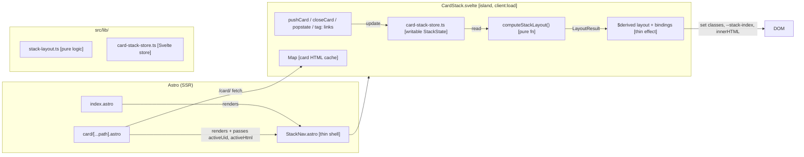

# Feature: Svelte Card Stack

## Context

The card stack in `StackNav.astro` is currently implemented as a large imperative vanilla-JS `<script>` block. During review of the `horizontal-card-stack` plan, it was found that `updateStackLayout()` mixes computation with DOM mutation, violating the "decisions are pure, effects are thin" principle. Before building horizontal layout, this plan migrates the card stack to a Svelte island (`CardStack.svelte`), which gives us reactive state management for free, a clean split between pure layout computation and DOM effects, and a solid foundation for the horizontal-card-stack feature.

No Svelte or `@astrojs/svelte` is currently installed — this plan adds both.

## Architecture Decisions

1. **Add `@astrojs/svelte` integration** — `npm install @astrojs/svelte svelte` and register in `astro.config.mjs`. Svelte 5 (runes syntax) is preferred as it is the current stable release; runes align cleanly with the "pure decision functions + thin effects" principle.

2. **`CardStack.svelte` is a Svelte island with `client:load`** — all card-stack interactivity lives in this component. The `StackNav.astro` wrapper becomes a thin shell that renders `<CardStack client:load />` (and passes the pre-rendered active card data if present). The JS `<script>` block in `StackNav.astro` is removed entirely once the migration is done.

3. **Card stack state is a Svelte store (`writable`)** — the authoritative stack state is a `writable<StackState>` store defined in `src/lib/card-stack-store.ts`. `StackState` is a plain data object containing the ordered list of card UIDs and which UID is active. The Svelte component derives its render tree from this store. This is the single source of truth — no parallel DOM class tracking.

4. **`computeStackLayout()` is a pure function in `src/lib/stack-layout.ts`** — it takes `StackState` and returns `LayoutResult` (which cards are visible, which are hidden, whether overflow is needed, what `--stack-index` each card gets). No DOM access. Fully unit-testable without a browser. The Svelte component calls `computeStackLayout()` in a `$derived` expression and applies the result to the DOM via bindings.

5. **Card HTML is still fetched from `/card/<uid>` routes** — the existing SSR card routes remain intact. `CardStack.svelte` fetches the card HTML fragment and stores it per-UID in a `Map<string, string>`. The fetched HTML is injected via `@html` in a rendered slot. This preserves SSR-generated content (rich renderers, Astro-processed Markdown) without re-implementing them in Svelte.

6. **Card state is represented as plain data, not DOM classes** — the CLAUDE.md invariant ("card state lives in classes") is superseded by this migration. The Svelte store is the authoritative representation; the component applies the correct CSS classes (`stack-card--active`, `stack-card--collapsed`) based on store values. The stable class names remain intact for CSS targeting (they are styling contracts, not JS query targets).

7. **View Transition integration stays in the Svelte component** — `document.startViewTransition` is called inside `CardStack.svelte`'s event handlers (push and close), following the same pattern as before: set `viewTransitionName` immediately before, clear in `.finished`. The VT callback performs DOM mutations inside the Svelte reactive graph by updating the store. Svelte's synchronous reactive update flushes inside the VT callback, giving the VT snapshot the correct pre/post DOM states.

8. **`#card-stack` and `#homepage` IDs are preserved** — the Svelte component renders a `
` as its root element. `index.astro` retains `
`. The Svelte component receives a boolean prop `hasHomepage` and reaches the homepage element via `document.getElementById('homepage')` only for show/hide. This is the minimal coupling point: the card stack does not import any homepage type.

9. **Global event listeners (`tag:` links, `popstate`) move into the Svelte component's `onMount` / cleanup** — they are registered in `onMount` and deregistered in the returned cleanup function. This is idiomatic Svelte and equivalent to the current pattern.

10. **Pre-rendered active card (SSR, direct URL load) is passed as HTML prop** — `src/pages/card/[...path].astro` currently renders the active card's HTML directly. It will pass the card's `uid` and rendered HTML as props to `<CardStack client:load activeUid={path} activeHtml={...} />`. `CardStack.svelte` seeds the store from these props in `onMount`. This preserves the SSR fast-path for direct URL loads.

11. **CSS stays in `global.css`** — card stack styles (`.stack-card`, `.body-wrapper`, etc.) remain global. The Svelte component does not use `<style>` for stack-level styles — only for any component-internal structural concerns (if any). This preserves the CSS custom property convention and avoids Svelte's scoped-style hashing interfering with the stable selector contract.

12. **The existing `StackNav.astro` file is replaced, not deleted** — it becomes a thin Astro shell that imports and renders `<CardStack client:load />` with appropriate props. Its `<script>` block is removed. This minimises disruption to pages that import `StackNav`.

## System Diagram

## Structure

### New Files

- [ ] `src/components/CardStack.svelte`
  - Svelte 5 island (runes syntax)
  - Props: `hasHomepage: boolean`, `activeUid?: string`, `activeHtml?: string`
  - Renders `
` with reactive card list derived from store
  - Handles: `pushCard`, `closeCard`, `expandCard`, `collapseCard`, view transitions, scroll, URL updates
  - Registers `popstate`, `tag:` link, and homepage delegated click listeners in `onMount`
  - Calls `computeStackLayout()` in `$derived` for layout state

- [ ] `src/lib/stack-layout.ts`
  - Pure function: `computeStackLayout(state: StackState): LayoutResult`
  - `StackState`: `{ cards: CardEntry[], activeUid: string | null }`
  - `CardEntry`: `{ uid: string }`
  - `LayoutResult`: `{ visible: LayoutCard[], overflowUids: string[], needsOverflow: boolean }`
  - `LayoutCard`: `{ uid: string, stackIndex: number, isActive: boolean, isCollapsed: boolean }`
  - No imports from Svelte, no DOM access
  - Unit tests in `src/lib/stack-layout.test.ts`

- [ ] `src/lib/stack-layout.test.ts`
  - Tests for `computeStackLayout()`: zero cards, one active, multiple with collapsed, overflow threshold

- [ ] `src/lib/card-stack-store.ts`
  - `writable<StackState>` Svelte store
  - Exported `stackStore` for use by `CardStack.svelte`
  - Helper functions: `pushToStack`, `removeFromStack`, `activateCard` — all return new `StackState` (pure), applied by the component

### Modified Files

- [ ] `src/components/StackNav.astro`
  - Remove the entire `<script>` block
  - Add frontmatter import of `CardStack.svelte`
  - Render `<CardStack client:load hasHomepage={!!homepage} />` (no SSR active card props; those come from the card page)
  - Keep the component file so call sites (`index.astro`) are unchanged

- [ ] `src/pages/card/[...path].astro`
  - Pass `activeUid={path}` and `activeHtml={renderedHtml}` to `<CardStack client:load />`
  - Remove the hand-written `.stack-card` HTML block (Svelte component renders it)
  - Keep `

` for the show/hide toggle

- [ ] `src/pages/index.astro`
  - No structural change; `<StackNav />` still renders as before (thin shell delegates to Svelte)

- [ ] `astro.config.mjs`
  - Add `svelte()` to integrations

- [ ] `package.json` (via `npm install`)
  - Add `@astrojs/svelte` and `svelte` as dependencies

## Dependencies

- **`@astrojs/svelte`** — new integration
- **`svelte`** — new framework dependency
- **`/card/<uid>` routes** — still serve card HTML fragments; fetch logic is unchanged
- **`global.css`** — all stack styles remain there; `CardStack.svelte` adds no new CSS classes to the stable selector contract
- **View Transitions API** — still used inside `CardStack.svelte`; same guard pattern (`document.startViewTransition?.bind(document)`)
- **`src/lib/cards.ts`** — unchanged; still the card data layer for SSR routes
- **`vitest.config.ts` / `src/test/vitest-env.ts`** — unchanged; `stack-layout.ts` tests run in the existing happy-dom environment

## Unknowns & Experiments

### Svelte 5 + `@html` for fetched card fragments

- **Unknown**: Svelte 5's `{@html}` injects raw HTML strings. The fetched card HTML contains Astro-rendered markup that may include `<script>` tags (e.g. renderers with client-side behaviour). Does `{@html}` execute scripts in the injected HTML? If not, are any current card renderers broken by static injection?
- **Risk**: If injected scripts are silently dropped, any card renderer that relies on inline scripts would break. Would require switching to `innerHTML` with manual script re-execution, or moving those scripts to a separate fetch-and-eval step.
- **Experiment**: Create a test page that uses `{@html}` to inject an HTML string containing a `<script>` tag and observe whether it executes. Also check current card renderers for any `<script is:inline>` usage.
- **Result**: pending
- **Impact**: pending

### View Transition callback inside Svelte reactive graph

- **Unknown**: Svelte's reactivity flushes synchronously on store updates in Svelte 5. When the VT callback fires, we update the store to add the new card. Does Svelte flush the reactive update (and therefore mutate the DOM) synchronously within the VT callback, as required? Or does it batch to a microtask/frame, which would give the VT an empty callback DOM?
- **Risk**: If Svelte's reactivity is async within the VT callback, the VT snapshot would not capture the new card, breaking the morph animation. We'd need to call `flushSync()` inside the callback to force synchronous DOM writes.
- **Experiment**: Build a minimal Svelte 5 island with a store-driven list and a `startViewTransition` call; inside the callback, push to the store and check whether the DOM change is captured in the VT new-state snapshot.
- **Result**: pending
- **Impact**: pending

## Notes

- 2026-04-18: Initial plan. Prerequisite migration for `horizontal-card-stack`. Migrates card stack from vanilla-JS StackNav script to a Svelte 5 island, introduces `computeStackLayout()` as a pure function in `src/lib/stack-layout.ts`, and uses a Svelte store as the single source of truth for stack state. Two experiments queued: `{@html}` script execution behaviour, and VT callback flush timing with Svelte 5 reactivity.
</content>
</invoke>