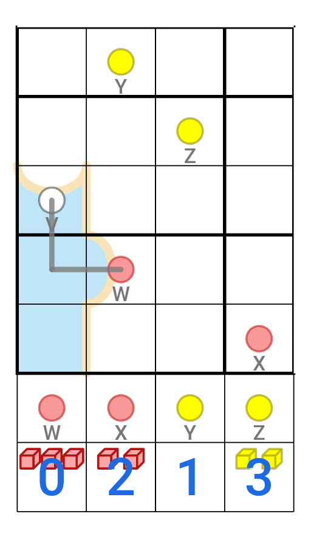
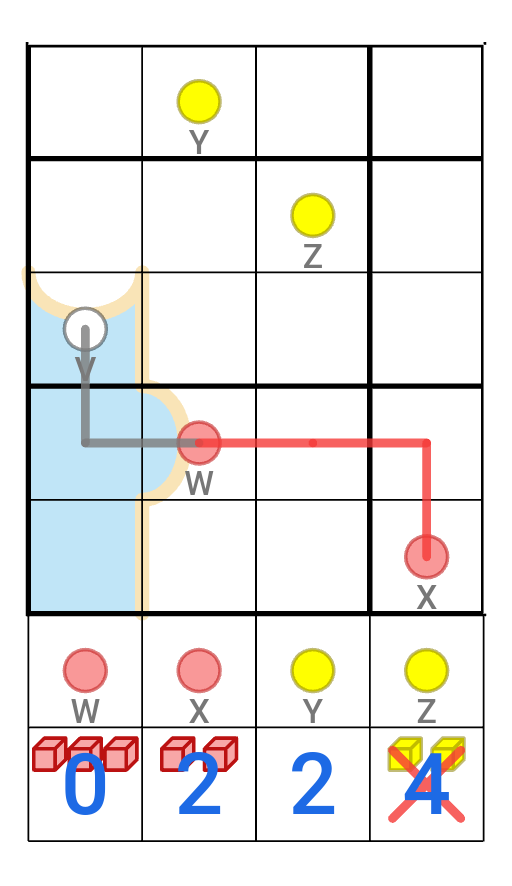
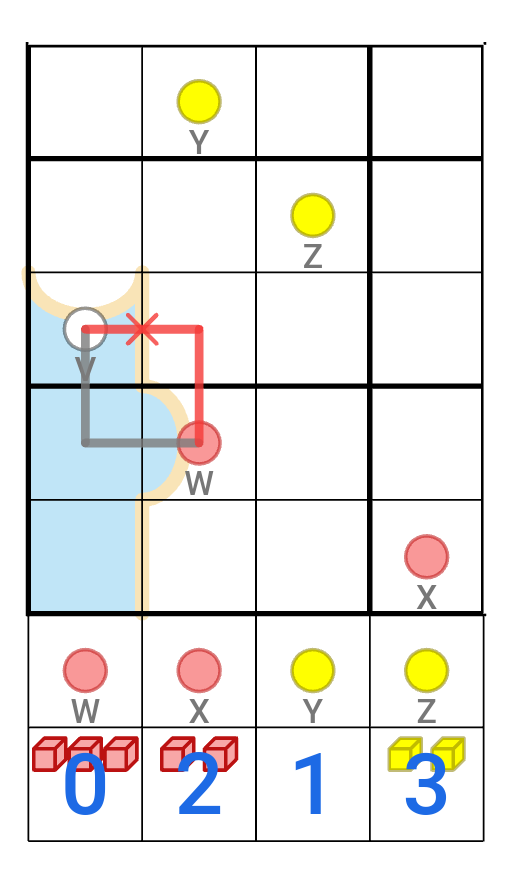
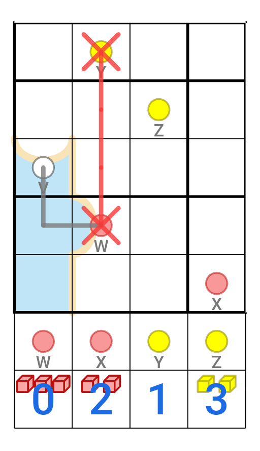
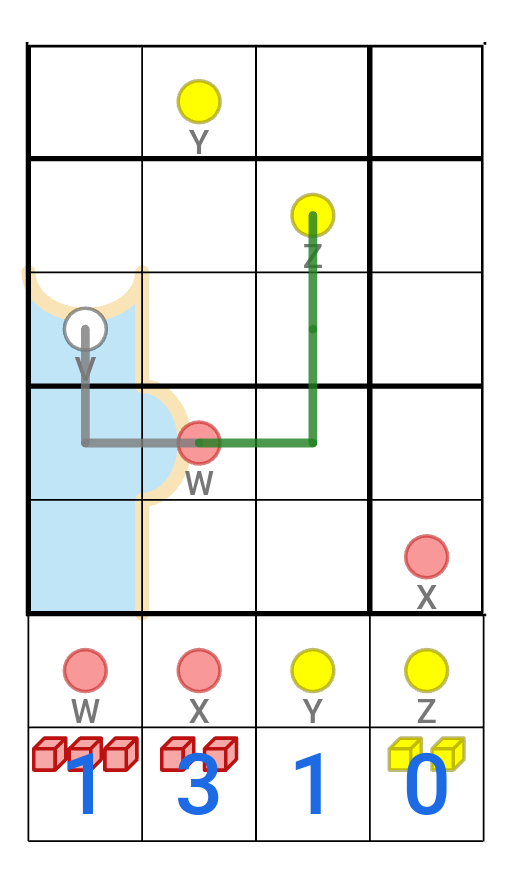

This is a puzzle based on the board game Pandemic, where you start at a city and move between cities to treat diseases, prevent outbreaks and find cures.

## Rules

**Normal Sudoku Rules Apply:** Fill the (9x9) grid with digits 1 to 9, so that each digit occurs exactly once in every row, every column and every 3x3 box.

**WATER:** Some parts of the grid are shaded blue. These parts are water, and the rest of the grid is land.

**COASTLINES:** Coastlines divide the water from the land. When a straight coastline divides orthogonal digits, the digit on land is higher than the digit at sea.

**CONTOUR LINES:** Curved, thin green lines are contours. Each line has a "high" side and a "low" side, to be determined by the solver. If two orthogonal digits are separated by a contour line, the digit on the "high" side must be higher.

**CITIES:** Cells with dots on them are cities. **Two cities of the same colour cannot share a digit**. White cities are research centres, and count as all colours (and so cannot share a digit with any other cities).

**INFECTED:** At any time, each city has a certain number of infection cubes. The starting cubes for each city are shown at the bottom of the grid - you should keep track of how many cubes each city has here. The bottom two rows are not a part of the solution. If a city ever has 4 cubes, there is an outbreak.

**PATHS:** Starting at city A, move around the grid by tracing a path between cities. Each path between two cities:

- must only move orthogonally
- cannot overlap or cross other paths (except at cities, where they can meet)
- must have the same length as the Manhattan distance between the cities (# of rows apart + # of columns apart)
- cannot cross a coastline
- cannot pass through a city without visiting it
- can only be used once
- forms its own region sum line - region boundaries divide the path into segments which sum to the same number. Note that each path represents a separate region sum line.

You can only count as having moved to a city once you know the exact path you must take to that city. A city may be visited multiple times.

**TREAT AND INFECT:** After each move from one city to another, remove all cubes from the city you arrive at. Then add 1 cube to every city whose colour doesn't match yours. Because Research Centres count as all colours, they will never gain cubes, and no cubes will be added anywhere when you visit them.

**CURE:** Once you visit all cities of a colour, visit a Research Centre to discover a cure for that disease. Once you do this, no more cubes will be added to cities of that colour.

**TO WIN:** Avoid any outbreaks and cure both diseases.

### Example

This example uses a section of a 6x6 sudoku, with the cities V, W, X, Y and Z.

In this example, the first path (between V and W) has already been drawn. W is treated (cubes go down to 0), and Y and Z (being of a different colour) each gain a cube.

From here, we can't go to X, because doing so would add a cube to all yellow cities. This would lead to an outbreak at Z.

Going back to V would prevent an outbreak (at a white research station, no cubes are added anywhere), but there's no valid path to V - we can't retrace our steps or choose a path longer than 2 segments, and the shown path crosses a coastline.

So we must go to Y or Z. In order to go to Y, you must go in a straight line. But this creates a region sum line between W and Y, which would imply that W and Y have the same value.

So in the end, we must go to Z. The shown line is the only valid one (I'll leave why to you). As a result, Z loses all its cubes and W and X each gain one.
