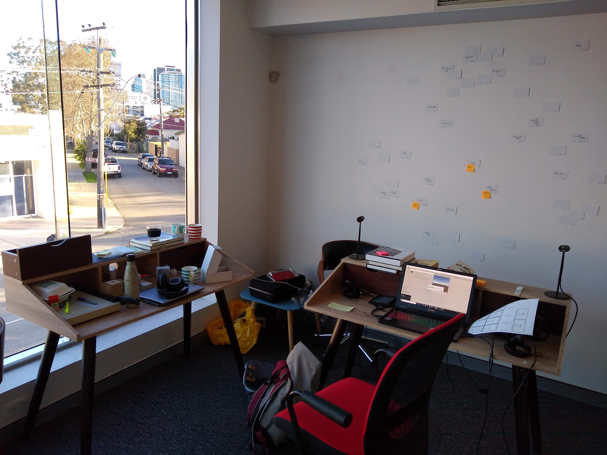
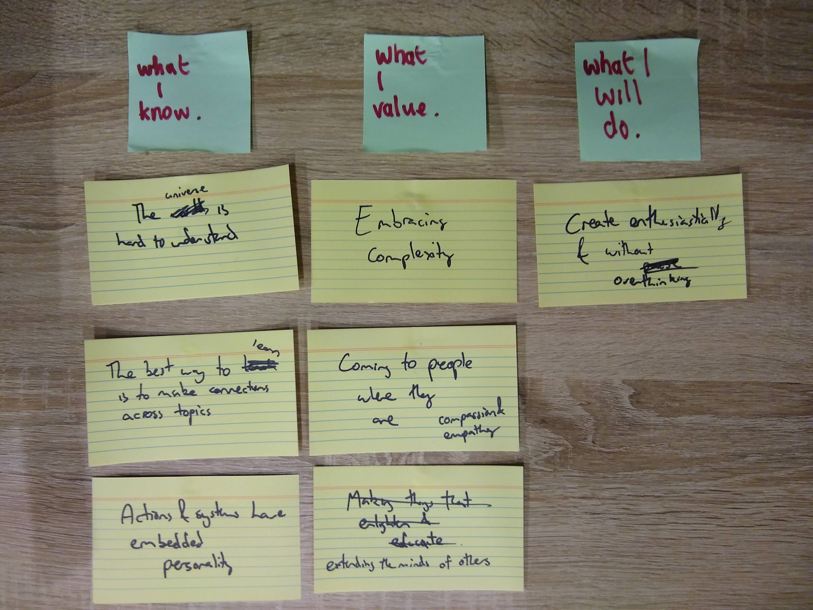
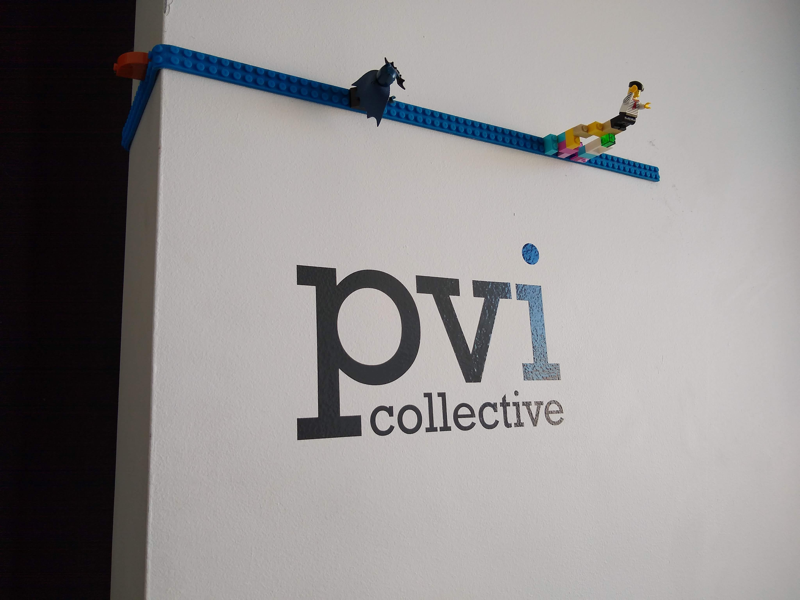

This blog post started as a diary that I wrote about 6 weeks ago, at the halfway point of my artist residency at pvi.

That residency is now finished. Thankfully, this post is kind of about why I might not post this post (cue inception horn here), so with a bit of editing, it’s still good!

### Wait, a residency?

OK, let’s back up a bit. For the past 3 months I’ve been in Perth, working out of the offices of pvi collective and getting mentoring from the artists here.

I went into the residency with some pretty simple goals*:

- to get back into the habit of creating in a way that will outlast the residency; and
- to actually get something finished (part of this was ‘make smaller things that can get finished’)
- to work out how I’m going to talk about what I’m doing, release things etc.

*ok, when I went in these goals were not this clear or simple, but by about the halfway point it was clear that this was what I was after

### Wait, creative anxiety?

This is going to be one of those blog posts, isn’t it?

The biggest surprise of this residency has been just how long it can take to get back into a creative mode after a break. Due to, well, life, I’ve not really done a lot of my own creative work for about a year. And getting back to it has been tricky.

Part of the problem was that I’d built up this residency a bit in my head. This was going to be my grand return. I was going to get shit done, release wonderful things all the time and get my groove back.

The other part is that I’ve built up a heap of half-formed ideas, and they’ve been piling up in a pretty unhelpful way. When it comes to actually starting on something, I had to make some choices.

What exactly should I make?

I probably spent about a month just on that question. I mean sure, I worked on some things in that time, but it was half-hearted, because I never knew if it was ‘the right thing’. I was torn between working on an existing idea and starting something new. Nothing was really grabbing me as the obvious thing to do: existing projects had big holes in them; and new projects weren’t as exciting.

As time ticked by, my anxiety grew as I failed to really get a purchase on anything. By taking this residency, I’d essentially promised myself that I could make something interesting, that my time was well spent on this. That it was worth working less and delaying some higher levels of financial security.

Which meant that my creative anxiety combined with my financial anxiety. Add to that the anxieties of being in a new city and of finding a place to live, and things got a bit panicky. Each of these anxieties are things I’ve dealt with in the past individually, and individually they aren’t even necessarily a bad thing, but together they were tough to handle.

### So, Creative Anxiety…

I’ve never believed that people are or aren’t ‘creative’, it’s never felt like an innate trait, but something that you practiced to get good at. That hasn’t changed, but this experience gave me much better insight into what happens when you haven’t practiced.

A big part of any creative endeavour is feeling safe to fail, because if failure isn’t safe then you shut down creatively, and you don’t try to actually express yourself. And a big part of the practice of creativity is learning to build safe spaces for yourself and expanding your zone of safety. Doing this lets you make more expressive things, show your work to others (which is important if you’re making things for other people), talk about what you’re doing and collaborate.

At the start of this residency, I’d get stuck whenever I tried to do anything expressive, I wasn’t sharing my work online, I wasn’t getting people to playtest (which is a cardinal game design sin), and collaboration wasn’t even something I was considering.

All of those things required me to make choices and to feel safe in those choices, and at the time, I didn’t, so I didn’t make them.

By the end, I’ve got 2 clear projects with somewhat ambitious aims (it’s true, I have trouble with ‘simple’), I’ve started posting stuff online, I’ve demoed a card game at events, I’m collaborating with a super talented artist on that card game, and I’ve (probably) published this blog post (at the time of writing, this still isn’t certain… cue inception horn yet again).

I’m not all the way there yet – I’ve still not shipped anything, and asking for money for my work is still yet to come, but it’s a great start.

## So, why write this?

I suppose I first wanted to just acknowledge this thing I’ve not properly understood until now: just how important the role of feeling safe in creativity is.

I also wanted to expand on creativity as a learned skill, one that’s potentially more about feeling safe to express, explore and play than anything associated with a particular form. Without that safety (and the confidence that comes with it), it’s hard to be creative at all.

But mostly, hopefully this helps others. The best thing would be if someone reading this realises that they’re struggling with creative anxiety, and can then take active steps towards feeling safe creatively.

## Active Steps

OK, let’s talk about those. I’m not going to pretend that I know what the best approach is, because it definitely will vary from person to person. But these are some things that helped me.

### Write a manifesto, or a design document, or whatever it is you want to call it

The first thing that helped me claw back some safety was putting together a manifesto. This was something I did with the guidance of the pvi artists, which was hugely helpful.

What I ended up with is essentially a version of the design document I make for any project I do for someone else, but of course I didn’t do it for myself.

A manifesto sounds bigger than it is in this context: it’s basically an expression of what you care about in your practice. When I first started working on mine, I overthought it and tried to make grand statements, but the fact is that simpler is better. The grand statements can evolve from those simple statements over time.

The nice thing about this is that it lets you trial out different expressions of your goals, expressing yourself in small ways that are quick to make and react to.

It also lets you try on different levels of safety for size. For instance: I care a lot about making positive impact with my work, but caring about this too much is making the creation process unsafe, stopping me from making anything at all. So for now, I’m taking a step back on that front, and I’ll slowly bring it back into my manifesto as it makes sense to do so.

Like with any good design documentation, it’s a living document. Right now, mine is a set of post-it notes.

I really like this approach to manifesto, partly because it’s simple and easy to change. It lets you express where you are at the moment without putting any barriers to reconsidering that later down the track.

### Mentoring

This was pretty vital. Just having people who were interested in what I was doing, who wanted to help me push it forward, was pretty great. A big shout-out to the pvi folks for that.

If you’re not super lucky, chances are you won’t have this built in. The next best thing is to find someone in a similar spot and to help each other, hold each other to account and so on. I’m currently in the process of finding accountability buddies for different aspects of my life, because it makes such a big difference.

### Show your work

I think this is the crux of it: you need to share with someone. At first, it can be just 1 or 2 people that you’re really comfortable with, but your goal should be to slowly expand that bubble as you go.

Starting to talk about my work with people I’d just met was pretty key for me. Not because I got universal praise (some people just don’t care about cool representations of stars, and there were some pretty terrible rounds of card games), but because I started to get real reactions. You get something to react to, something to work from. And the whole thing didn’t explode or stop being something I wanted to make, which is nice.

So now I have 2 projects on the go. One about stars and one about fate. And a budgeting app that I’ve got to make some decisions about (yeah… I should probably finish and launch that).

### Go easy on yourself

Looking back at the three goals I started with, I’ve only finished the first (get back in the habit of creating), but I’ve made good progress on the other two. The fact is that I don’t think I was in a position to finish all three of these in this 3 month period, and I think I would have been a wreck if I’d pushed myself to do so.

So the final step is to go easy on yourself. It’s not a safe space if you’re beating yourself up, and without safety there is no creativity.

And with that, I’m going to finish this. And then I’m going to work on finishing something else.
