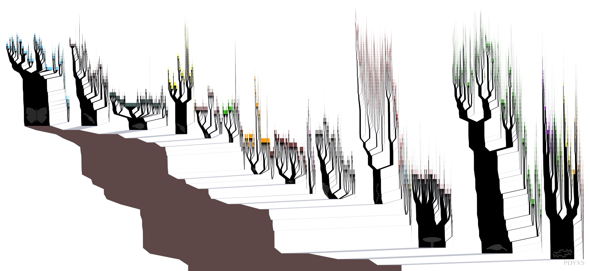
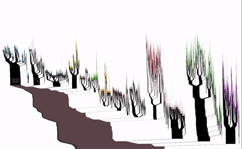
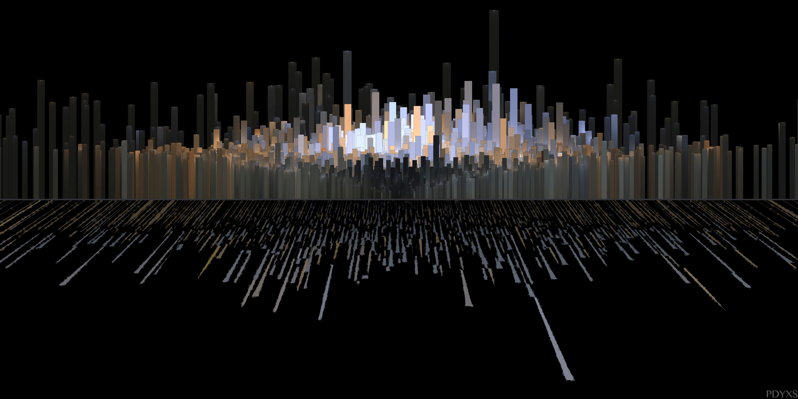
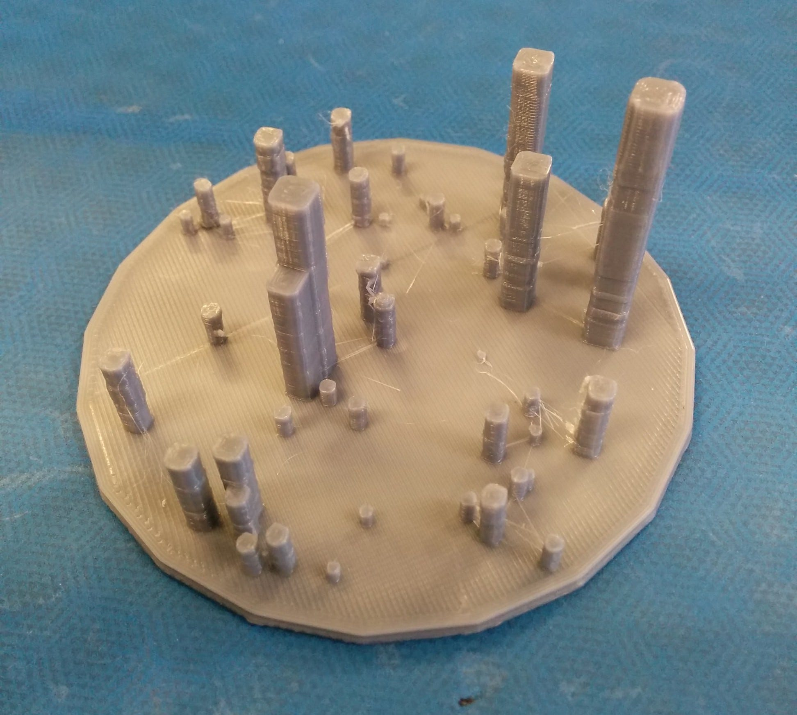
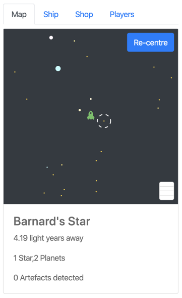
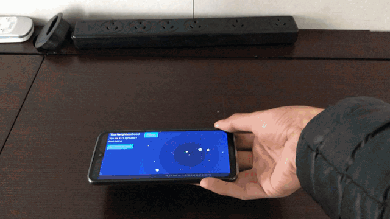
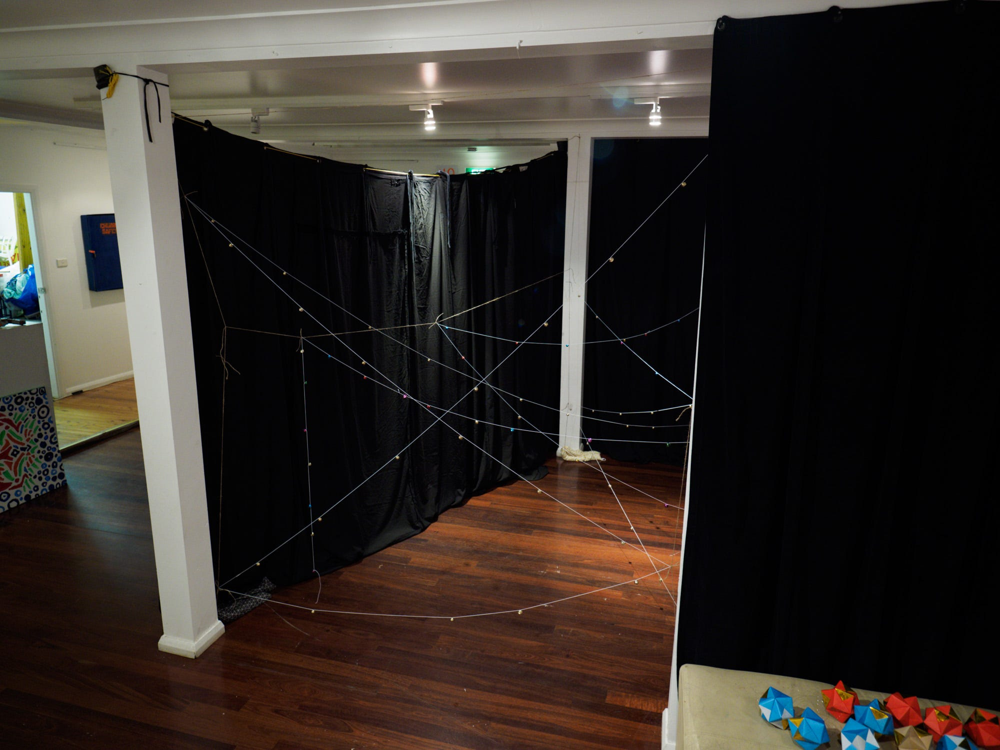
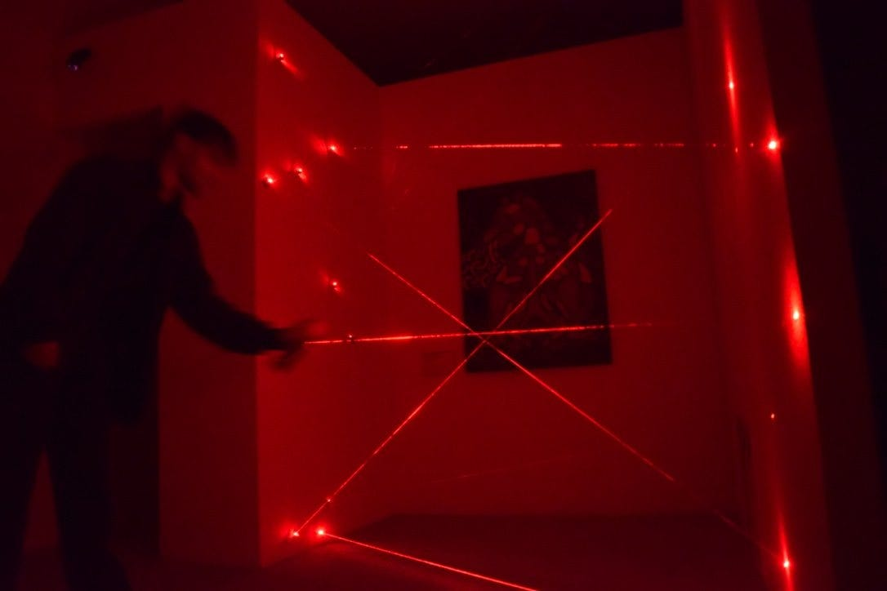

### The joy and utility of shelving projects

We’re in a weird time at the moment, in a way that makes the phrase “we’re in a weird time” seem quaint and ridiculous. Most of us are stuck at home, and many are suddenly faced with a *lot* more free time.

There’s been a bit of an undercurrent of opportunity in this situation, as some have seen that this is a pretty great opportunity to pick up creative projects, to learn new things, or to get your life in order in a way that there just never seemed time for before.

Others have correctly pointed out that it can be pretty unhealthy to expect yourself to be creative at a time of massive stress and uncertainty. Because no-one needs the stress of feeling like they’re not being productive enough on top of the apocalyptic stresses that are currently circling us all*.

*Side note: maybe read and watch less news. I’m not saying I’m good at this, but I am better at it when people remind me, so here’s a reminder for you.

So today, I want to share an approach I’ve started taking to side projects that helps me to be kinder to myself: shelving them. It’s mainly a mental trick, but it’s one I’ve found really useful.

This is it: Instead of thinking of having a project stop or end or go on indefinitely, you shelve it, ready for a better time. By doing this, you short-circuit a lot of the sunk cost fallacy and the stress that comes with it, and gain some surprising benefits along the way.

To illustrate exactly how this works (when it works), I’m going to talk about a few projects that started 4 years ago. I’ve realised that I practiced pretty great shelving technique on these projects without thinking about it (while not doing so for other projects), and I think they illustrate the benefits of the approach pretty well.

## Back in 4 BC… (Before Coronavirus)

A few years back, I made a couple of data artworks for an art exhibition I put together with 3 friends, called Art Heist.

I’d never worked on data art before (or made anything that would fit inside a gallery), so it was exciting to experiment with the form. But I was also new to the form, and by the time of the exhibition I had 2 pieces which were nice to look at, but mostly failed to convey the things I was aiming for.

It was the epitome of the phrase “art isn’t finished, only abandoned”. Except I wasn’t quite done with them.

### The Path

[The Path](card:what/art/the-path) is a visualisation of the Open Tree of Life as a series of trees along a path. My favourite part of “The Path” is that this particular path has Moths and Butterflies at its end, rather than humans (which are somewhere in the middle of the very crowded ‘Vertebrates’ tree). I mean we all knew deep in our hearts that Butterflies are the ultimate end goal of evolution, right?

It took a few months to end up at this image, and while I’m happy with it in many ways, it really doesn’t do a great job of communicating what it is or what it means. As someone coming from a games and education background, this feels kind of wrong. And while I don’t want to go to the infographic place (where everything is labelled to the exception of all metaphor), this felt too far on the abstract art end of the line for me.

But it was done and we’d had the exhibition, so I left it. Shelved it, even.

For a couple of months.

It was bugging me that this piece didn’t meet my standards, and so I started playing with it again. Specifically, I started thinking about bringing it to an interactive digital medium — what might an app of this visualisation look like?

I made a quick prototype of what this might look like in Unity (a game engine I use for work): the original visualisation with some depth and animations. The maths to make this 2D image work in 3D space while maintaining its dimensions were really interesting, and I was really happy with the result.

I then thought about what it would take to ‘finish’ this off — my vision involved each tree turning into its own path that could be navigated. This would be, to be frank, incredibly difficult. So, I shelved it, and haven’t returned to it since.

One day it might make sense to return to this project, but until then, it’ll remain on the shelf.

### The Neighbourhood

[The Neighbourhood](card:what/art/the-neighbourhood) is a visualisation of the 8912 (ish) stars visible to the naked eye (ish because different people have different eyes) as a cityscape. I made this because I felt that it was deeply strange that it’s incredibly rare for anyone to have an innate feel for where we sit amongst the stars: even if you know all the stars and constellations, you don’t have a feel for the actual geography (as dim, close stars look the same as bright, far stars).

The Neighbourhood, then, was an attempt to rectify that — to make the geography of our galactic neighbourhood easier to understand, by turning the stars into buildings.

It was a failed attempt. Mostly because a side-on view was way prettier than anything actually useful.

Again, while I wasn’t 100% happy with the result, it worked in many ways and it was finished, and so I moved on.

For a couple of weeks.

For this project I went in a very different direction, making some small 3D prints of the city. I was pretty happy with the result, but didn’t know where to go with it (a large sculpture seemed like where this was going, but was also something I didn’t feel equipped to tackle).

So I shelved it.

Over the next year or so, I had lots of thoughts about the project and what I might be able to do with it, at one point imagining it as a fairly pokemon go-esque game where you literally walked between the stars. This is one of the advantages of shelving: sometimes all a project needs is time away from the pressure of making it.

Because a year or two later, I was given the opportunity to design a location-based game and had a large amount of creative freedom, and this project was there, waiting patiently on the shelf. This is one of the massive advantages of building up a shelf of potential projects: if you do, there’s a decent chance that you have an existing idea that you’re excited about that fits a brief you’re given. Which means you’re more likely to be paid to make something that really excites you.

That project unfortunately didn’t end up being built, and I didn’t really have the technical capacity to do it myself (the server implementation was a bit too complex). So I shelved it, and picked it up about a year later when I had some more time to experiment (as a part of my residency with [pvi collective](https://pvicollective.com/)). I made some simple prototypes to prove the concept and got it to a point where I had a clear vision (no server required!), but recognised that I needed to finish off a couple of other projects first.

So again it’s been shelved, but it’s now a clear concept that’s on a slate. When I’ve got the time and capacity to do it (is during a lockdown a good time to make an app that’s encouraging walking around?), I’ll come back to it, and that feels pretty good.

### Art Heist

As a part of the exhibition, the four of us also put together an interactive theatre piece, where teams of 4 came in after hours to try to steal a painting from the art gallery. It was a bit like an escape room, but actually played more like a real-life recreation of a stealth action game. It was rough, but really great and fun to put together.

And it wasn’t something any of us expected to come back to ever again.

A year or so later, a friend who’d helped us in the original version asked if we’d like to make a more professionally produced version of [Art Heist](card:what/art/art-heist). I jumped at the chance to work on something like that again, and we made… Art Heist. Ok, so the name didn’t change, but everything else did.

The second run for Art Heist was about 3 months, and even though the run was extended twice, it wasn’t a show that could be run long-term. We occasionally came back to the idea of running it again, but it’s quite a tough show to put on and we never quite worked it out.

A few months ago, I was talking to the producer of Art Heist about projects we might want to work on, and a follow-up to Art Heist came up. For the first time since the original, it felt like we were both in the right place (both mentally and physically) to work on such a project, and now we’ve started to lay the groundwork.

## Stress and anxiety

I’ve focused a lot on the times when things happened on these projects, because stories are about things that happen. But I think that the most important aspect of shelving these projects happened in the time between them.

Because when I think about these projects compared to others that I’ve failed to shelve properly, I can see a clear difference in the amount of anxiety I feel about them. An open project you continually fail to finish is stressful. A shelved project is an opportunity for your future self.

## So What do I actually do?

It’s tough to give concrete advice on *how* to implement shelving, as to me it’s more of a realisation than it is a series of steps. You realise that it’s not that big a deal to shelve something, and that it’s both fine and a good thing to come back to shelved projects every so often. And hopefully, that helps you let go, and to make better decisions.

If you wanted, you could literally have a shelf, and use that to impose limits on how many active projects you have at a time. Or you could have a spreadsheet, or any other number of realisations of this concept. Certainly, once you have the realisation, there are optimisations to be made. But those are most likely very different for each individual.

## Release

One such optimisation that I’ve been thinking a lot about is ensuring that you release a project before you shelve it. Historically I’ve not been fantastic at this, and it’s the main area I’m looking to improve.

When I say release, I mean taking a small amount of time to put whatever you’ve made into a releasable state and getting it out there, and not worrying if it’s not exactly what you wanted. This helps you let go of it, lets you see reactions to what you’ve done, and lets others get excited about what you’re doing, even if it’s rough. It’s what made the experience of the original Art Heist exhibition so important: I made some stuff, released it, and then let it go… until it made sense to come back to it. It allowed me to build on partial successes, rather than waiting for something to be complete.

I have trouble doing this (the perfectionist part of my brain is hard to deal with), but I’m working on it.

And yet, I don’t think that releasing publicly is more important than your ability to release internally: to be kind to yourself when doing more isn’t feasible, and to ensure that you’re in the best state possible for whatever you’re doing right now.

So work on what it makes sense to work on, and stop working on it when it stops making sense to do so. Above all, have confidence that if it is the right project, you’ll come back to it when the time is right. None of your time is truly sunk: it was either spent getting the project ready for the future, or helping you learn what projects are right for you.
