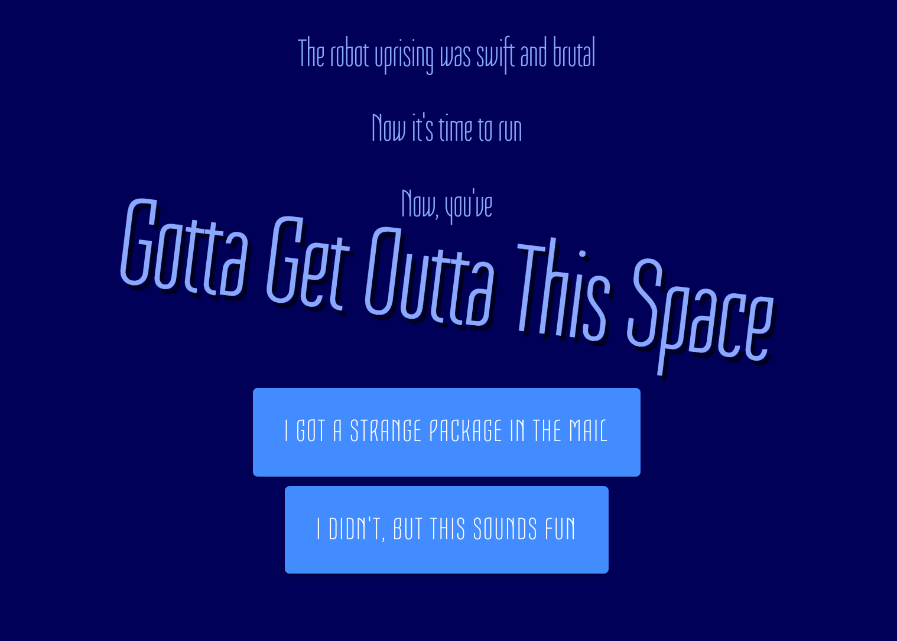

### An incrementalist approach to developing a creative practice

In the wake of writing *[The Shelf](card:what/writing/2020-04-29-not-quite-abandoned)* (a blog post where I advocate shelving projects until it’s the right time for them), I had a few people asking me about how shelving might work as a concrete process. I also found myself asking a pretty simple question: “What projects are right for me at the moment?”

For a while, I’ve been working part-time on purpose, with the intention of using the extra time to work on my own projects. And I have worked on them, but I’ve also purposefully kept them low-key and low-pressure, focusing more on regaining creative confidence than creating a thriving practice (more about that in *[On creative anxiety…](card:what/writing/2019-07-18-on-creative-anxiety-and-residency-retrospectives)*). Because at some level, I’d never really gotten over the issues that plagued me when I wrote *[Starting Over](card:what/writing/2016-05-02-starting-over)* back in 2016 (I swear that’s probably the last link to a past blog post): worry that the next thing *has* to be better.

There’s only so far you can go before you have to run at something properly, and I’ve hit that point. As I’ve mentioned in several of those blog posts before, I still need to work on certain skills: finishing and releasing projects, talking about them, and actually building some sort of income.

In general, I’ve hit a point where I need to focus on building a creative practice, and working out what that looks like.

Today, I’m going to outline the approach I’m taking to do just that.

## The approach: Momemtum*

*Not a typo — momentum just doesn’t have enough m’s.*

The system is simple: each month, make a goal for each of the 4 m’s:

1. **Make**: make something. This should involve a release of some kind.
2. **Market**: talk about what you’re making. Have a goal about how you’re going to reach more people
3. **Monetise**: There needs to be a way for people to pay for what you’ve made (or what you’re making next). Have a goal for how you’re going to make that work better
4. **Measure**: Have a metric that you look at. Or revise your existing metrics.

This is strictly an incrementalist approach to building a business/practice. The idea is to get a tiny bit better each month at everything. It also forces you to not ignore the things that creators usually ignore: the business development part of the practice (marketing and monetising).

Forcing a release of some kind each month isn’t completely necessary, and I may drop that requirement at some point, but right now it’s important for me (as mentioned above, finishing things is something I need to work on).

## What this looks like

So, we’re a week into May. And I’m working on a May project.

This is what my May goals look like:

### **Make**:

- Create ‘Gotta Get Outta This Space’ — a print, play and post game where you escape a robot uprising on a spaceship, and then send that spaceship to your friend’s houses so they can escape as well

### **Market**:

- Post at least 1 update about the game to social media each week (insta/fb/twitter)
- Blog about this framework (✔), and at the end of the month about progress/next month’s goals
- Send at least 2 emails to the mailing list.

### **Monetise**:

- Implement some sort of “pay what you want” system on the website
- Make a print-on-demand version of the game
- Make sure that I’m keeping track of income properly so that I can pay collaborators easily and effectively.

### **Measure**:

- Measure game website usage
- How far are people getting in the game? Are they doing the ‘post’ part?

What’s as important as what’s here is what *isn’t* here: the hundreds of things that I’d try to do if this game’s success was vital. Updating my website. Cross-posting my blog posts to my website. Working out how to segment my mailing list. Actually making it easy to find the sign-up to the mailing list. Having clear goals for my measurements. Deciding if this falls under the “SeeThrough Studios” banner (probably), and making a new website for that if it does. Doing a *lot* more marketing. Any PR. Should I be on Patreon?

Incrementalism says that all you need to do is to work on being a bit better than last month. Which is great, because I really need to not deal with all of that at once.

It’s even more important because this isn’t *all* that I’m working on. I have some longer-running projects that need to keep going, but which work at a fairly low (up to 1 day per week) commitment level. Those projects will really benefit from the work I do here — by the time they launch, I will have practiced these skills and built some community around my work.

So, at the end of this month, I’ll have another blog post. And hopefully there’ll be a lot of checkmarks next to all of these goals, and a game where you can get outta a space.

I’ve kept this short(er) and sweet(er) (than my normal blog ramblings), but it’s left a lot out. I’ve got more detail on each of the 4 m’s and how I’m wanting to approach them in the medium-term, and I’ve started thinking about how I’m organising my project slate. So let me know in the comments if there’s something you want more detail on — maybe I’ll add a section to the end of month blog post.
