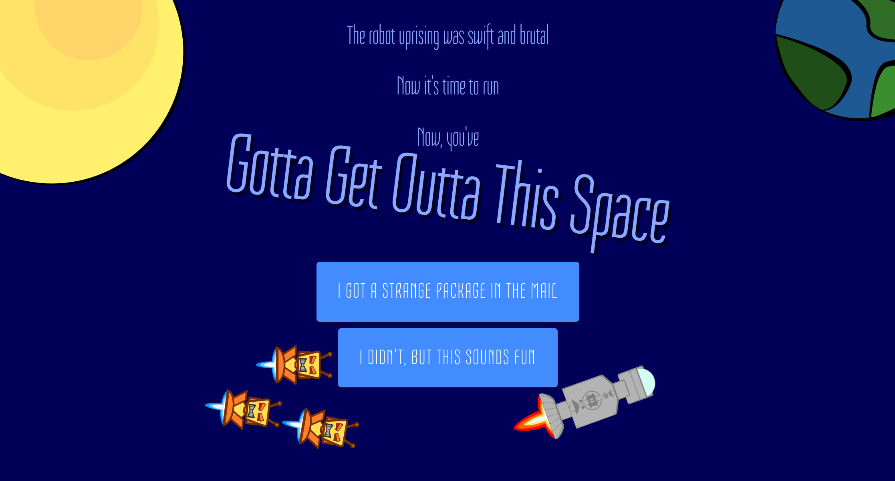
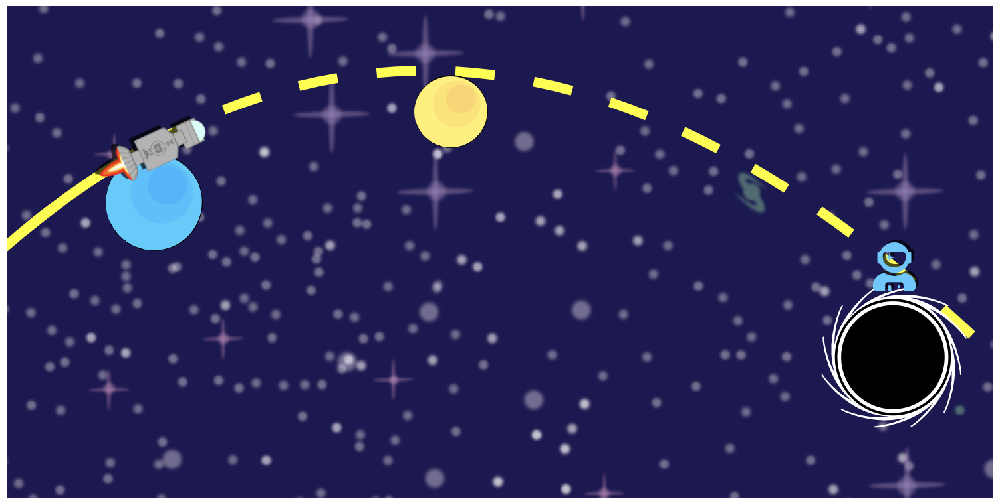
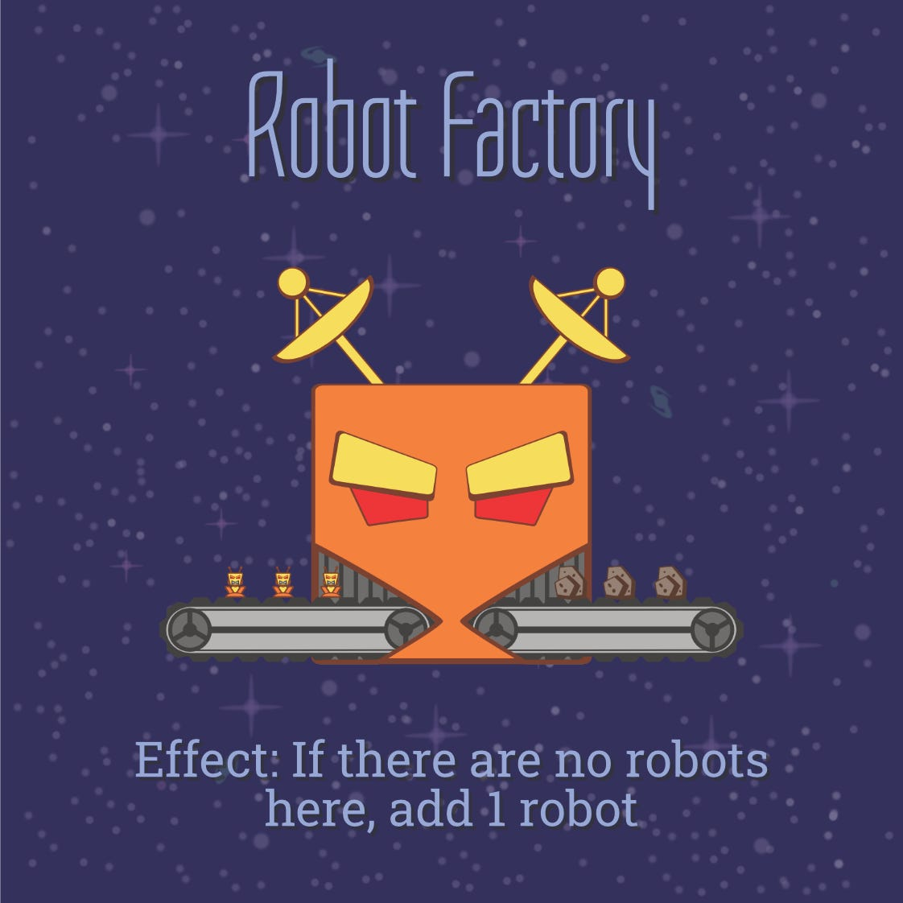
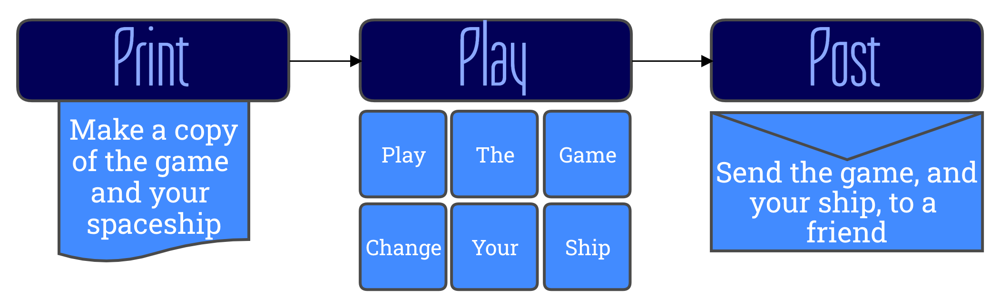

### Why pre-production and post-production matter

So, it’s just about a month since I started my ‘[let’s make and release a project every month](card:what/writing/2020-05-08-momemtum)’ thing, and I said that in May, I was making a game, and hmm… where’s the game?

Cut to Sunday night — I’m lying in bed, making some final changes to the code for ***Gotta Get Outta This Space*** (the aforementioned game), after a pretty hectic weekend of building. I finish the final piece (updating the game’s logbooks), commit and push them. It’s 3am. The game’s not got every single feature I wanted, but it’s pretty damn close, and I’m overall pretty happy with it.

The next morning I wake up, dreading the day to come — I’ve still got a bit of work hooking up the monetisation systems, and I should really do some social media if I’m actually launching this thing, and I’m still waiting for the decks to be approved by the print-on-demand company… and this week I’m supposed to start the next project…

On my way to my morning coffee I stop myself. Wasn’t the point of this whole exercise to find a way to consistently create in a ***healthy and sustainable way***? This doesn’t feel healthy, or sustainable. It feels like a train-wreck waiting to happen.

So I made the immediate decision to push back the launch by 2 weeks.

## Phase Space

While I do feel that I need to spend 2 weeks to launch ***Gotta Get Outta This Space***, there’s not 2 weeks worth of work there. Some of that is preparing social media posts, and making sure that people can actually buy the game, and making a project budget so I can decide if I’m going to buy stock (so I can send it to people in Aus with lower shipping costs). But as much of it is just that there’s a lot of things that need time to sit, or to register.

And at the same time, there’s a lot of work for my next project that is exploratory in nature, that I’d like to start on ASAP.

It was suddenly pretty clear that I was thinking about post-production and pre-production, and that I’d somehow forgotten that projects need these stages.

### A brief explainer

Pre-production, production and post-production mean very different things in different industries and different projects, but there’s some commonalities that I find really useful.

**Pre-production** is where you work out what you’re making. It’s all the things you need to do so that Production goes smoothly. Most research and experimentation resides in this phase, and a lot of the planning as well. Often pre-production will end with some sort of prototype.

**Production** is where you make the thing. The core of the build goes here, and hopefully goes quite smoothly because of the work you did in pre-production. At the end of this phase you should have a finished thing, though it might not be polished.

**Post-production** is whatever you have to do to finish. This is where final polish, documentation, and release activities go. It’s also where you do beta testing and more extensive QA than you can do in Production.

### Why these are separate

In larger projects, these are separate because different people work on different parts. But even in smaller projects, separating your timeline into these three parts.

**Pre-production** ensures that you take some time to plan and to develop effective pipelines before you start the actual project. It also gives you some time to ramp-up into the right head-space.

Separating **Production** allows you to really focus during this phase, and gives you some clear limits on your scope. Without this, it’s very easy to let production go right to the end (ie. what I did this last month), leaving very little space for release activities.

**Post-production** plays a similar role to pre-production — ensuring that you take the time to actually do release activities and polish. Importantly, you can do these without worrying that the product is going to change significantly during this time — whatever you got out of Production is basically what you’re releasing. This is especially important when messaging about the project and writing documentation.

### Not Quite Equal

While all three phases are crucial for project development, they’re not all equal in size.

Production is easily the largest of the three phases in terms of effort, being the core of the build.

However, both pre-production and post-production really benefit from taking more time, even if there’s less effort involved — there’s more activities in these phases that cause delays, or that benefit from having time to mull on problems.

## Momemtum going forward

So, here is my plan going forward:

I’ll still be doing a project every month (and still using the basic [Momemtum framework](card:what/writing/2020-05-08-momemtum) for those projects), but those projects will have a bit of a different timeline:

- The first 2 weeks will be pre-production
- The next 2 weeks will be production
- The final 2 weeks will be post-production, coinciding with the pre-production of the next project
- Then, release! In the middle of each month
- The days that make a month more than 4 weeks will mysteriously sort themselves out. Most probably I’ll take a break

What I like most about this is that it creates a nice 2-week rhythm. At the end of each 2 week block, I’ll have a chance to take a breather and reflect on how this is all going, and post some updates on that.

These will mostly go to my mailing list, so if getting updates on what I’m making and being asked to playtest things sounds like your jam, [sign up here](https://mailchi.mp/8f99b7489352/pdyxs-mailing-list-signup).

And that’s it! I, of course, reserve the right to change all this as soon as it stops making sense. If that’s going to happen, it’ll probably happen about a month from now, as production for the next project is wrapping up…

Until then, I hope this has taught/reminded you why pre and post-production are really useful for organising projects. And hopefully that’ll lead to less stressful 3am finishes for everyone.

*Art in this post is from **Gotta Get Outta This Space**, and was made by Alistair Magee and myself*
