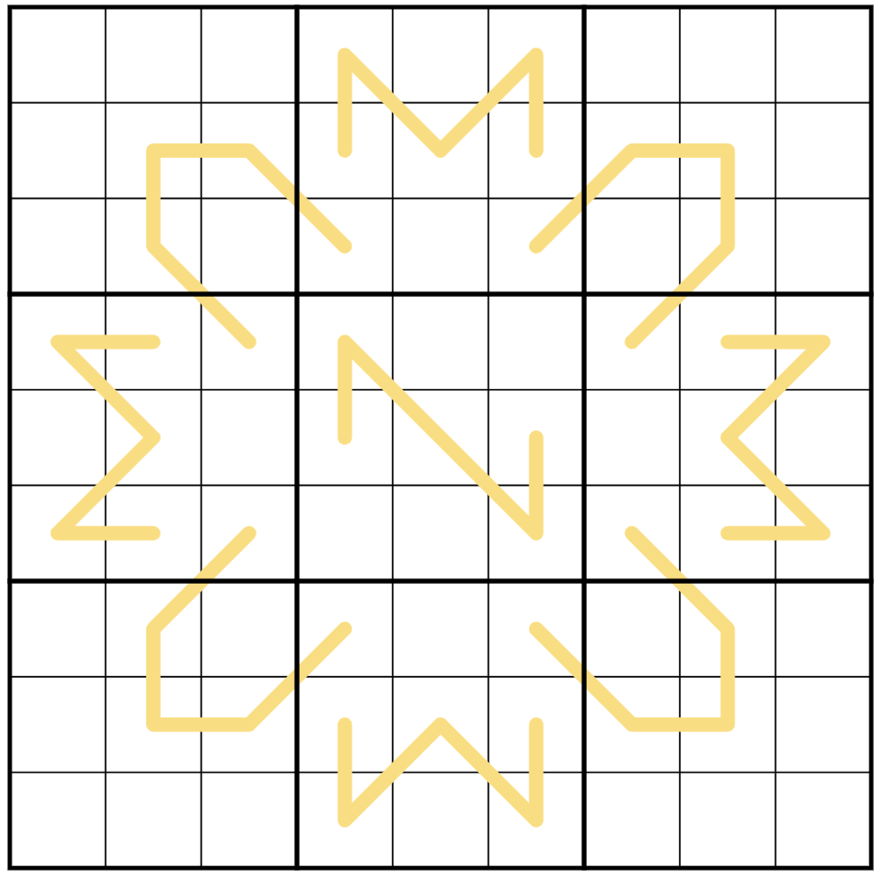
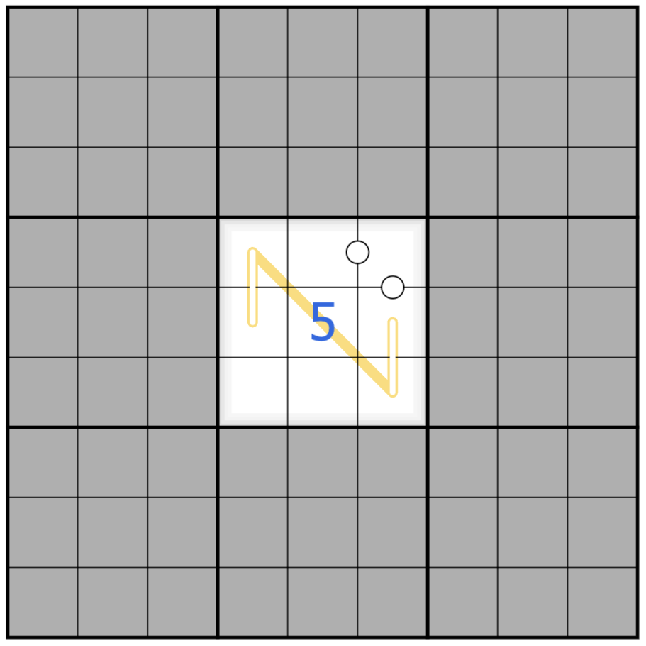
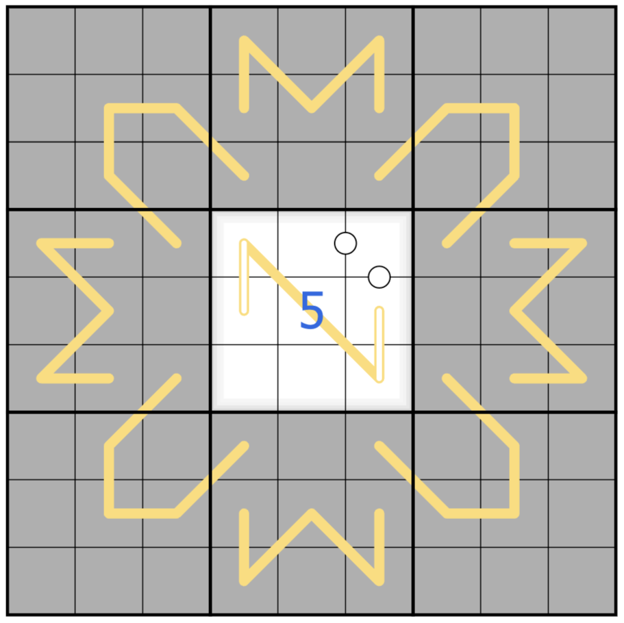
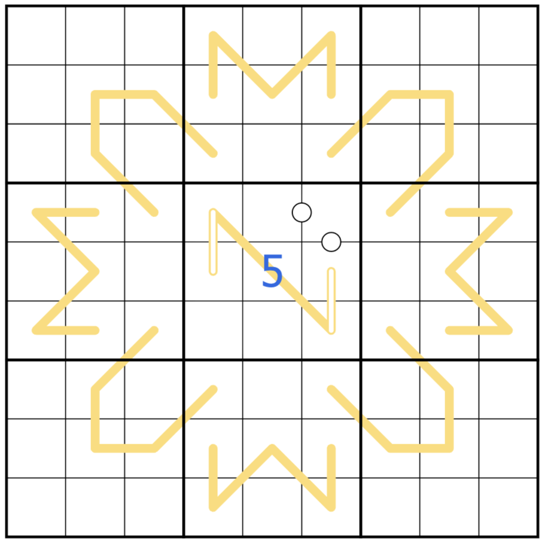
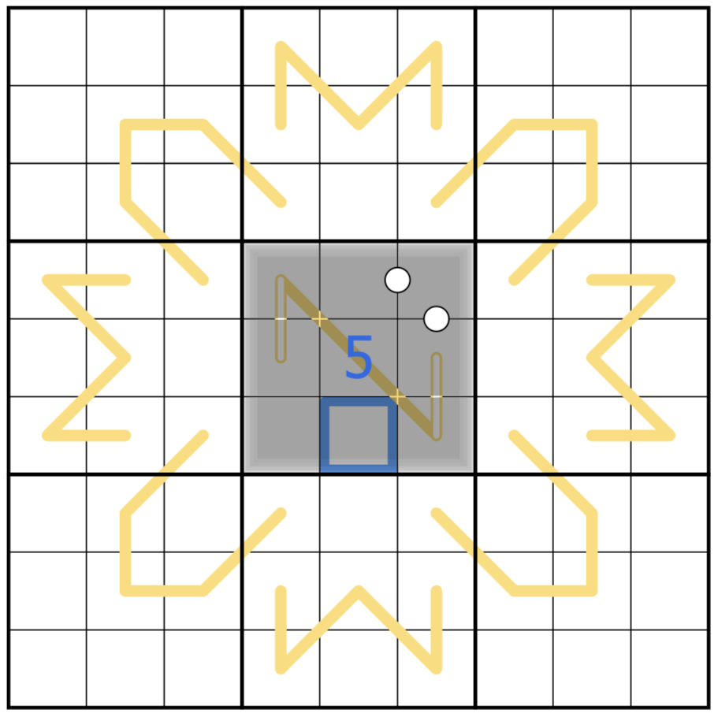
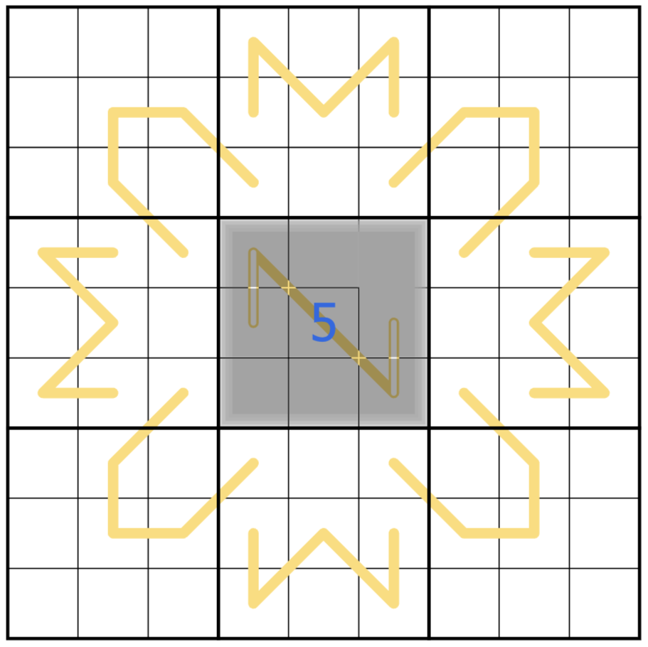
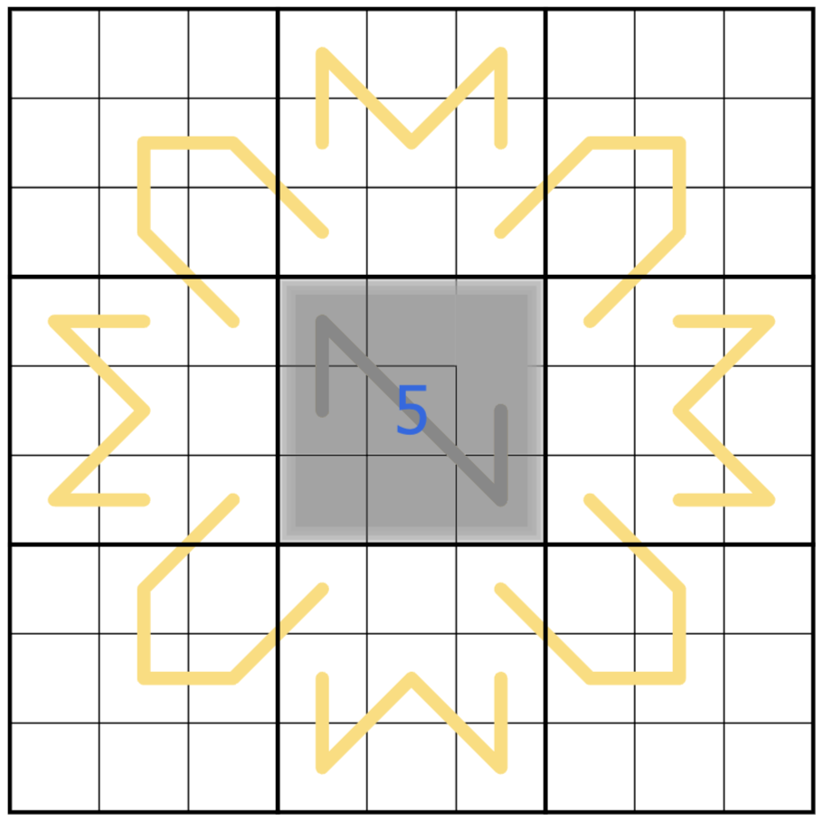
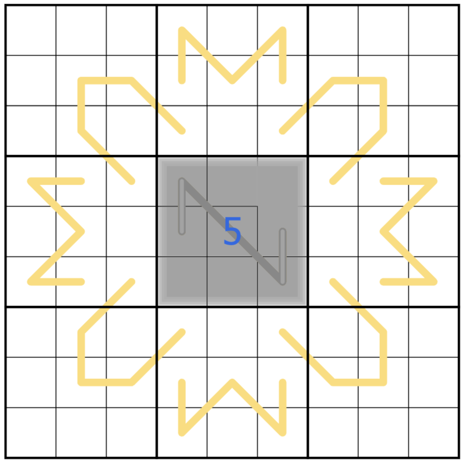

A few weeks back I had a bit of a silly idea: what if I reversed the fog of war in sudokupad, so that entering correct digits summoned fog instead of clearing it? I had an inkling of how I could technically do it, but had quite a few details to sort out.

Today, I’m going to step through how I built the puzzle. I think that the implementation is pretty instructive for how you can have a lot of fun with the sudokupad rendering engine, and should help you understand some pitfalls to avoid when setting your own puzzles.

I’m writing this mostly for people who are interested in the puzzle-setting process, and am assuming some familiarity with tools. I’m also implementing this using code, but you could also hand-build the puzzle’s json file if coding isn’t your thing.

If you’ve not given the puzzle a go, you can try it [here](https://sudokupad.app/pdyxs/sunny-with-a-chance-of-fog). The rest of this post is going to have some (very limited) spoilers, so give it a go!

*The final puzzle*

## Technically Fog

The big secret here? It’s actually just normal fog, twisted so that fog looks like not-fog, and not-fog looks like fog.

You can see the full implementation over on [my puzzles repository](https://github.com/pdyxs/sudoku-puzzles/blob/main/src/data/pdyxs/puzzles/sunny-with-a-chance-of-fog/index.js).

### Step 0: Use SudokuMaker

I generally start creating puzzles in [SudokuMaker](https://sudokumaker.app/), and then export the json to my own tools to do secondary processing. In this case, I tried as much as possible to use standard visuals in sudokumaker to create the puzzle, and then transformed those later using code. The advantage of doing this is that I could always return to SudokuMaker to make changes, knowing that my code would transform the output correctly each time.

You can find the Sudokumaker file [here](https://tinyurl.com/26uud3fu).

This is what that looks like, with a digit entered:

*This is normal fog… and quite unsolvable*

### Step 1: Move the renban lines above the fog

Probably the biggest secret of making things render above fog is that everything should be a ‘line’. Lines in sudokupad’s json format can specify a ‘target’ layer, and some of those target layers appear above fog.

Also, because all lines are rendered in order, you have really fine control over your ordering when you only lines (in a way that’s less clear when you combine them with shapes and text).

In this case, I’m taking all the renban lines and moving them to the ‘cell-grid’ layer.

*Shiny! You’ll notice that you can now only see hollow lines under the fog*

### Step 2: Make the fog, look like not fog

Here’s where things get fun. I create a white box (using a line with a white ‘fill’) in each cell to go in the “cell-highlights” layer. This layer is rendered when there is fog, but is below the “cell-grids” layer (so doesn’t obstruct gridlines, and can be rendered over later).

Using ‘cell-highlights’ like this is almost certainly why some tools (like the colour tool, line tool and screenshots) in sudokupad simply don’t play nice with this puzzle. So beware of using this if you’re setting a puzzle where solvers are likely to want to use colours!

*What fog?*

### Step 3: Summon the fog!

This is the key step. I create semi-transparent, black boxes in the ‘overlay’ layer for each cell. The overlay layer is both beneath the fog, and above everything else (don’t think about it too hard…), so it’s perfect for this.

The reason I use semi-transparent black is that the overlay layer goes above the selection boxes - this means that if you use a solid colour, the solver can no longer see which cell is currently selected! With transparency, the selection box is darkened, but is still visible.

Note that you can still do a lot here. A [previous, abandoned iteration](https://sudokupad.app/e44hsqimz4) of this puzzle (it turns out that it’s very difficult to build a puzzle out of actually removing information using fog) used counting circles that were fully hidden by the fog. To make this work, I added solid grey boxes to cells with circles which were bigger than the circles, but which fit entirely within the selection box (thus hiding them without breaking the user experience).

*Ahh, that’s where it went*

### Step 4: Hiding some gridlines

At some point it became clear that the fog would have to convey some information, but I wanted to make sure that it did so only by hiding things, rather than showing new things. So using hidden grid lines in the place of kropki dots was a natural next step.

Here, I take the white kropki dots, remove them, and render grey lines across the associated cell grids in the ‘overlay’ layer. A lot of the work here is just getting the sizing right - too big and you’ll take out more of the grid, or a lot of the selection box. Too small and you end up keeping bits of the lines.

*Not a normal kropki dot…*

### Step 5: Grey renbans

I wanted to have the renban lines fade when covered, and I also had some ugly highlights where the lines went over gridlines. All I had to do here was to add the lines a second time in the ‘overlay’ layer, in a different colour.

*That looks a *lot *less janky*

### Step 6: Hollowing out

Unfortunately, using only white kropki dots + renbans = a puzzle with multiple solutions. So I needed another clue type. Black kropki dots were the obvious choice, but again, I wanted them to be rendered as something that the fog covered. I liked the idea of covering the lines somehow, and settled on hollow lines - this way I covered some of the line without sacrificing clarity.

To build this, I re-added the hollow lines as the same colour as the fog, again on the ‘overlay’ layer.

*Even more grey…*

## …and that’s a puzzle!

Hopefully that gives you some insight into how you can do strange things with sudokupad. I’d love to see what else y’all come up with (at the very least, I reckon there’s some fun to be had with invisible fog…).

If you’ve got any questions, let me know in the comments. And if you want to see more about board game and puzzle design, hit the subscribe button below.
