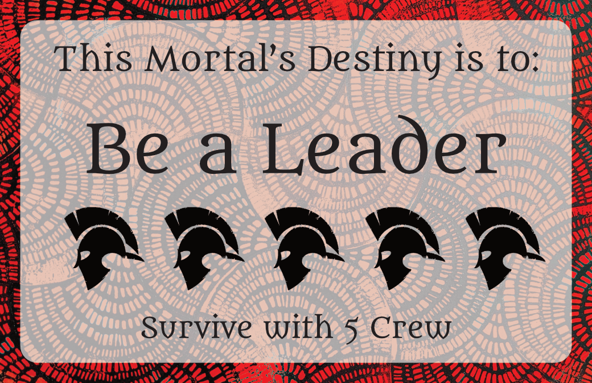
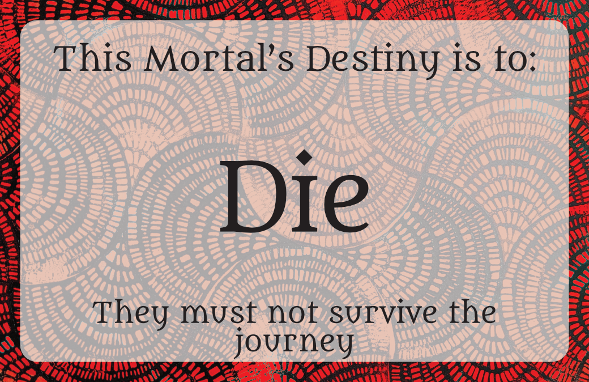
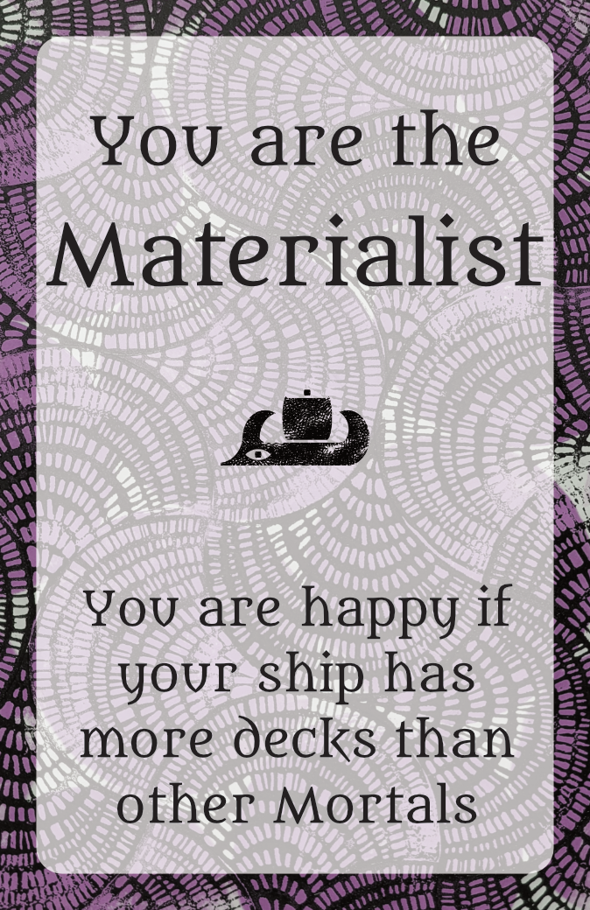
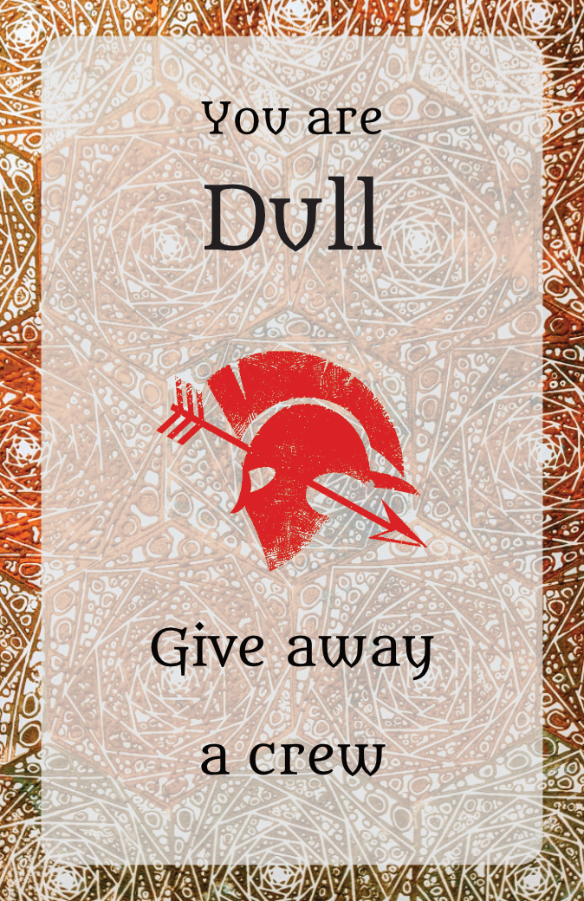

The Odysseys is a pretty old game at this point. I made the first version (which was called “The Feet of Fate”, and only really has a vague resemblance to the current game) way back in 2015, on a train between Chicago and San Francisco. Since then it’s waxed and waned, with covid (and long covid) being the latest reason that it’s sat on the shelf.

It’s also a great game for me to work on as I ease back into the world of game design. And as I round the 10-year mark, the same 10 years that it took Odysseus to return, it’s high time that I brought it home.

To finish off a game with such a long and varied history, it’s important to set out the boundaries of what the game is and isn’t, so you aren’t pulled too far off course. My preferred approach to this is pillars: three(ish) defined words or phrases that represent high-level design decisions. These become decisions that you can come back to throughout development to make sure that you’re focused on the right things.

I’d either somehow never written pillars for The Odysseys, or lost them somewhere along the way (I’m guessing the latter). So, as a way of coming back to the game and re-introducing it to the world, here some shiny brand-new pillars!

The Odysseys is an **entangled* ***adventure* *about your **reaction to privilege**

### Reactions to privilege

*A reaction to privilege is a choice taken in the knowledge that either you are advantaged by the systems around you, or disadvantaged by those systems. It asks you to choose what to give up when under pressure, and what to do with your extra space when you have it.*

When I say that the first version of The Odysseys was made in 2015, this is the part of that survives. Just before making the first version, I’d heard about a study where two players play monopoly, but one is given clear and blatant advantages. When the advantaged player was asked about why they won, they would only talk about how their own actions had lead to their victory. I hadn’t seen it at the time, but there’s a TED talk about it [here](https://www.ted.com/talks/paul_piff_does_money_make_you_mean)… which comes across as quaint in how it talks about the ultra-rich given what’s happened in the decade since.

So naturally, when I heard this, I wanted to make a game about it. A game that was intrinsically and unambiguously unfair, where players had to wrestle with that.

In The Odysseys, one player is Fate, and their job is literally to tip the scales. Each other player (the mortals) has a destiny, and Fate’s job is to make it happen. Some destinies are kind, and others are less so.

*A destiny to have a lot of crew! Isn’t it great when fate’s on your side?*

*This one seems less friendly*

Each mortal’s destiny is a secret, but it can quickly become apparent who is privileged, and who is not.

### Entangled

*To be entangled is to have a rich and complex network of relationships with those around you, a combination of intersecting incentives that pushes and pulls your actions.*

This pillar describes the heart of *how *The Odysseys achieves its design goals - by setting up layers of incentives that sometimes harmonise, and sometimes directly oppose each other, and then asking players which of those incentives they care about more.

Mortal players care about 3 main things:

- Surviving (if they lose all their crew, they die)
- Getting home (if you fulfil your destiny, you get home. But you can rebel, in which case you get home only if you *don’t *fulfil your destiny)
- Being happy - each player has a personal goal that makes them happy. Other mortals know about this, but Fate doesn’t

Importantly, there aren’t clear points or a clear winner - each player (even Fate) just has multiple goals that they might have to choose between. This design choice has stood up pretty consistently to playtesting - every time I’ve tried to introduce points or a clear win condition, the game gets worse as a result.

*An example of a Value*

### Adventure

*An adventure is an exciting voyage into danger, which pairs the tense and dramatic with light-hearted moments.*

This pillar is here to help set the tone of the game, and make sure that it doesn’t get too self-serious. It’s important that the game has real danger and encourages dramatic moments - big swings that can change the game state on a dime. But at the same time, it’s important for players to remember that this is *just a game*, and that it’s fundamentally a little bit silly. Adventure captures both of these ideas really nicely.

My favourite way to add a bit of levity into the game is through the naming of cards. A card that has you give away crew isn’t just “Give away crew”, it’s because you have a trait of being “dull”. The player who wants a lot of treasure is the “Curator”. What I like about these sorts of names is they take the world the game is in seriously, while still being a bit ridiculous.

### Pillared Out

And that, in a nutshell, is The Odysseys. Pillars are always pretty high level, so I’ve not gone much into the actual flow of the game. That’ll have to wait for next time, if there’s anything specific you want to know, let me know!

### What next?

I’m working on a couple of things at the moment:

- Balancing the game. It’s gotten a bit too nice for my liking, and I need to make it a bit more deathy
- I’m starting to look into how I can use components to explain the rules of the game. In particular, using Trait cards (which are already a concept in the game) to explain rules like “what happens if your ship sinks” quickly and easily, without needing to refer to a rulebook.

If you’re in Sydney and want to give the game a go, feel free to get in touch! Playtesting is a little irregular (long covid is a real pain for this), but I’m aiming to run it at least once a month.

I’ll be posting more about the game here, alongside other thoughts about puzzle and game design. If that sounds interesting to you, please subscribe!
